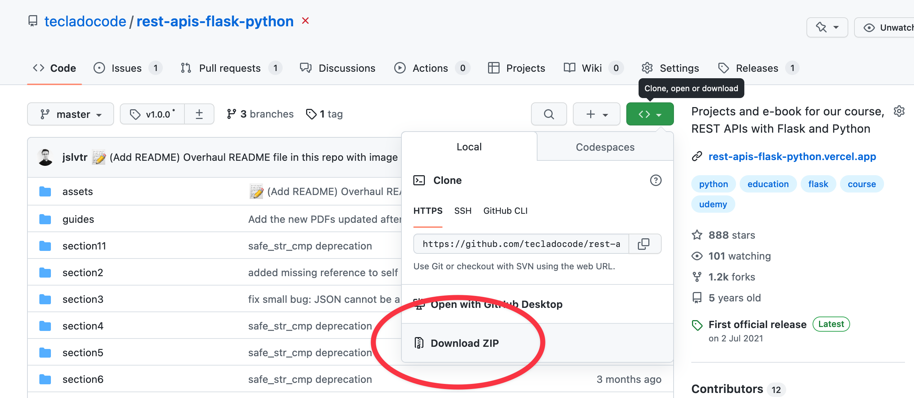

# REST APIs with Flask and Python

 </a>

    

---

💡 A full course to teach you how to use Flask and Python to make REST APIs using multiple Flask extensions and PostgreSQL.

## Getting started

Enrol in the course by going to [this link](https://go.tecla.do/rest-apis-sale).

Then you can come back here to download the repository. This repository contains the code that we develop in each section of the course.

If you are familiar with Git, you can use Git to download it. Otherwise, you can download it as a zip file:

Next, start taking the course at the beginning! You can use the downloaded code files to support you while you go through the course.

I also **strongly recommend** you code while you take the course. A good strategy is:

1. Watch the video intently, optionally while taking notes.
2. Watch again, more quickly, while typing the code together with me.
3. Once you're done with the video, play about with the code. Make changes, break things, then fix them, and try to thoroughly understand everything the code does.

If you do this for the entire course, I guarantee you will learn how to make REST APIs using Flask and Python well and quickly. You'll still be using Google and searching for stuff every day, but so does everyone else!

## Section 2: A Full Python Refresher

The code is in files numbered between 1 and 11, covering concepts ranging from beginner to advanced.

1. Variables
2. Methods
3. Lists, tuples, and sets
4. If statements
5. List comprehension
6. Dictionaries
7. Classes and objects
8. Static and class methods
9. Args and Kwargs
10. Passing functions as arguments
11. Decorators

## Section 3: Your first REST API

The code in this section includes a simple Flask app and a HTML and JavaScript file which calls the Flask app endpoints.

## Section 4: Flask-RESTful

The code in this section includes a Flask app which is an API that represents items. It also includes user registration and authentication.

We also introduce Flask-RESTful, which is a Flask extension that helps us develop APIs more easily.

## Section 5: Working with SQL

The code in this section extends the last section by adding persistent storage of Items to a SQLite database.

## Section 6: Flask-SQLAlchemy

The code in this section extends the previous section by replacing the manual integration with SQLite, with SQLAlchemy—an ORM (Object-Relational Mapping)—which allows us to easily replace SQLite with something like PostgreSQL or MySQL.

## Section 7: Git for version control

In this section we introduce Git, a tool for code sharing and collaboration. In this course we'll use it to store the application code and then send it to our deployment tools, Heroku and DigitalOcean.

## Section 8: Deploying Flask Apps to Heroku

Learn how to use GitHub and Heroku to deploy your Flask applications and make them available publicly to your users.

## Section 9: Deploying Flask Apps to our own servers

Learn how to rent a server using DigitalOcean and run our Flask app in it. This is an alternative to Heroku. It's much cheaper, but requires a lot more work to get it set up.

## Section 10: Security in your REST APIs

In this section we learn about https and how to enable it in your own server running with DigitalOcean.

## Section 11: Token Refreshing and Flask-JWT-Extended

Learn about token freshness and how to implement refresh tokens using Flask-JWT-Extended.
