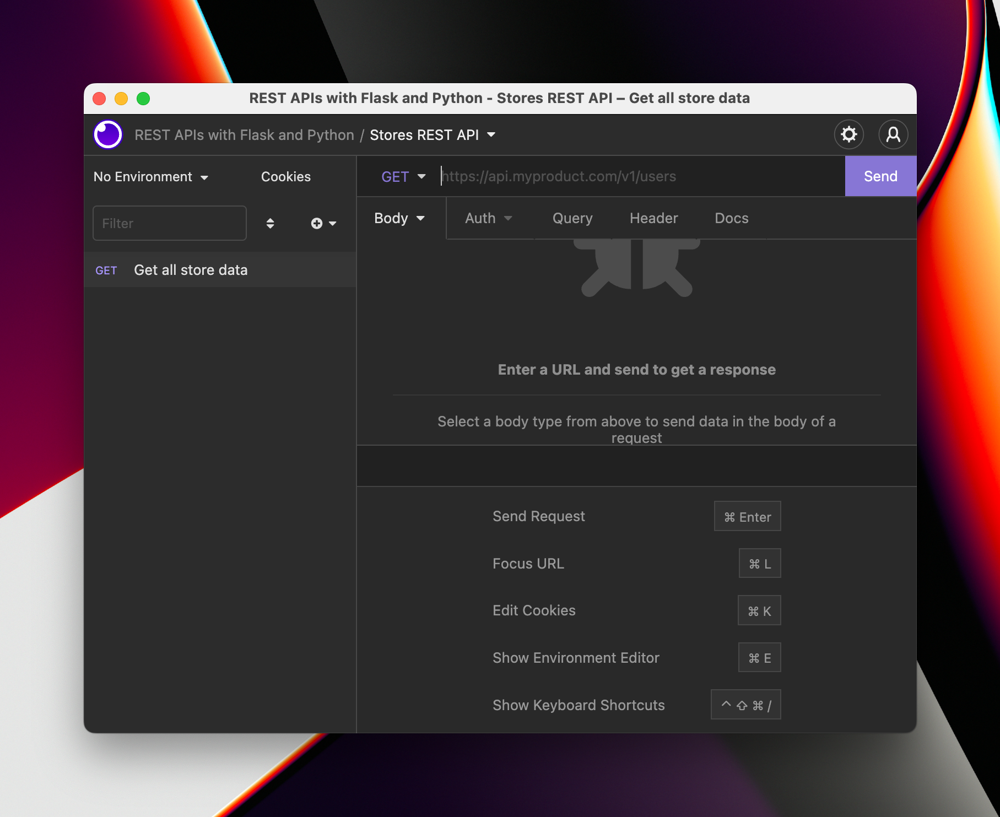

# How to make a request to a REST API

One of the most important things about any software development is to make sure that our projects work!

So we need to be able to test our project, run it, and make sure it does what we think it does.

There are two main ways of doing this:

- With automated tests.
- With manual, exploratory testing.

Usually you'd go with exploratory first, and then you'd make automated tests based on your manual tests.

In this course we won't cover automated testing of your REST API (it's a long topic, and we've got another course on it).

However, we will cover a lot of things you can do with manual testing.

There are two tools I use for exploratory testing: Postman and Insomnia. It's up to you which one to use, but if you haven't used either one before, I recommend Insomnia.

It's a bit easier to get started with, and it's free and open source.

Start by [downloading Insomnia REST Client](https://insomnia.rest/).

Once you've opened it, create a Project. I would call it "REST APIs with Flask and Python".


Then, create a new Request Collection. Call it "Stores REST API".


In the Request Collection, we can now add requests! Each request has a few parts:

- A **method**, such as `GET` or `POST`. The method is just a piece of data sent to the server, but _usually_ certain methods are used for certain things.
- The **URL** that you want to request. For our API, this is formed of the "Base URL" (for Flask apps, that's `http://127.0.0.1:5000`), and the endpoint (e.g. `/store`).
- The **body**, or any data that you want to send in the request. For example, when creating stores or items we might send some data.
- The **headers**, which are other pieces of data with specific names, that the server can use. For example, a header might be sent to help the server understand _who_ is making the request.

Let's create our first request, `GET /store`.

Make a new request using the Insomnia interface. First, use the dropdown to start:


Then enter the request name. Leave the method as `GET`:


Once you're done, you will see your request in the collection:



Next up, enter the URL for your request. Here we will be requesting the `/store` endpoint. Remember to include your Base URL as well:


Once you're done, make sure that your Flask app is running! If it isn't, remember to activate your virtual environment first and then run the app:

```
source .venv/bin/activate
flask run
```

:::caution
The Flask app will run, by default, on port 5000. If you have another (or the same) app already running, you'll get an error because the port will be "busy".

If you get an error, read it carefully and make sure that no other Flask app is running on the same port.
:::

Once your Flask app is running, you can hit "Send" on the Insomnia client, and you should see the JSON come back from your API!


If that worked and you can see your JSON, you're good to go! You've made your first API request. Now we can continue developing our REST API, remembering to always create new Requests in Insomnia and test our code as we go along!