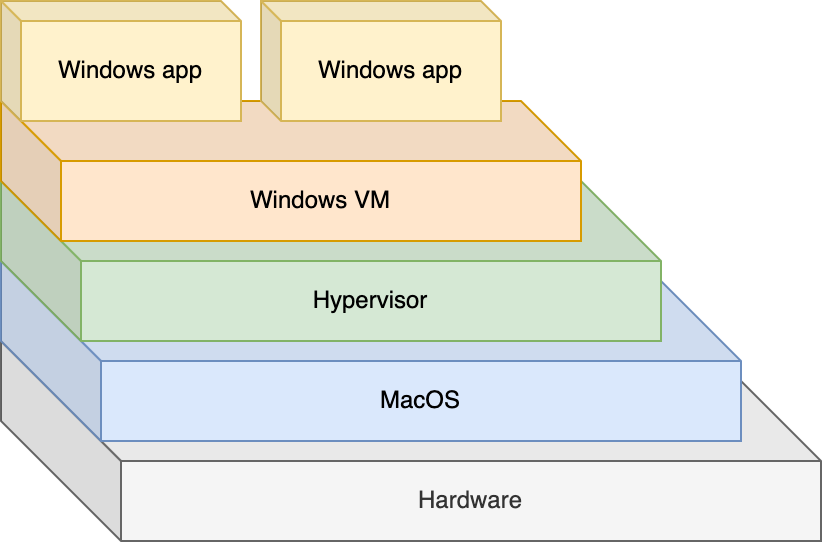
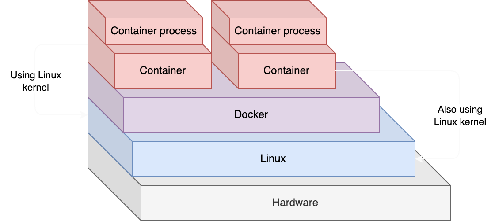

# What is a Docker container?

I'm sure you have heard of the term "Virtual Machine". A virtual machine is an emulation of an Operating System. For example, if you run a Windows virtual machine on your MacOS computer, it will run a whole copy of Windows so you can run Windows programs.

This diagram shows what happens in that case:



When you run a Virtual Machine, you can configure what hardware it has access to (e.g. 50% of the host's RAM, 2 CPU cores, etc).

Docker containers are a bit different because they don't emulate an Operating System. They use the Operating System kernel of your computer, and run as a process within the host.

Containers have their own storage and networking, but because they don't have to emulate the operating system and everything that entails, they are much more lightweight.

This diagram shows how Linux containers run in a Linux host:



Looks similar, but the `docker -> container` section is much more efficient than running a VM because it **uses the host's kernel** instead of running its own.

## What is a kernel? 🍿

An Operating System is made up of two main parts:

- The **kernel**
- Files and programs that come with the operating system

The Linux kernel, for example, is used by all Linux Operating Systems (like Ubuntu, Fedora, Debian, etc.).

:::caution
Since containers use the host's kernel, you can't run a Windows Docker container natively in a MacOS host. Similarly, you can't run a Linux container natively on Windows or MacOS hosts.
:::

## How to run Linux containers on Windows or MacOS?

When you use Docker Desktop (which I'll show you in the next lecture), it runs a Linux Virtual Machine for you, which then is used to run your Linux containers.

But aren't you then doing this?

```
hardware -> macos -> hypervisor -> linux vm -> docker -> container -> container program
```

And isn't that much less efficient than just running the program in a Linux virtual machine?

Yes. Running Linux containers on MacOS or Windows is "worse" than just running the programs in a Linux VM. However, **99% of the time, you will be running Linux containers in a Linux host, which is much more efficient**.

:::tip Why do we always run Linux containers in a Linux host?
When you want to deploy your applications to share them with your users, you will almost always be running your app in a Linux server (provided by a _deployment company_, more on that later). There are a few reasons for this. Among them, Linux is free!
:::

## Why are containers more efficient than VMs?

From now on let's assume we are running native Linux containers in a Linux host, as that is by far the most common thing to do!

When you run a VM, it runs the entire operating system. However, when you run a container it uses part of the host's Operating System (called the kernel). Since the kernel is already running anyway, there is much less work for Docker to do.

As a result, containers start up faster, use fewer resources, and need much less hard disk space to run.

## Can you run an Ubuntu image when the host is Linux but not Ubuntu?

Since the Linux kernel is the same between distributions, and since Docker containers only use the host's kernel, it doesn't matter which distribution you are running as a host. You can run containers of any distribution with any other distribution as a host.

## How many containers can you run at once?

Each container uses layers to specify what files and programs they need. For example, if you run two containers which both use the same version of Python, you'll actually only need to store that Python executable once. Docker will take care of sharing the data between containers.

This is why you can run many hundreds of containers in a single host, because there is less duplication of files they use compared to virtual machines.

## What does a Docker container run?

If you want to run your Flask app in a Docker container, you need to get (or create) a Docker image that has all the dependencies your Flask app uses, except from the OS kernel:

- Python
- Dependencies from `requirements.txt`
- Possibly `nginx` or `gunicorn` (more on this when we talk about deployment)

:::info Aren't there more dependencies?
The keen-eyed among you may be thinking: if all you have is the kernel and nothing else, aren't there more dependencies?

For example, Python _needs_ the C programming language to run. So shouldn't we need C in our container also?

Yes!

When we build our Docker image, we will be building it _on top of_ other, pre-built, existing images. Those images come with the lower-level requirements such as compilers, the C language, and most utilities and programs we need.
:::

Let's take a look at Docker images in the next lecture.