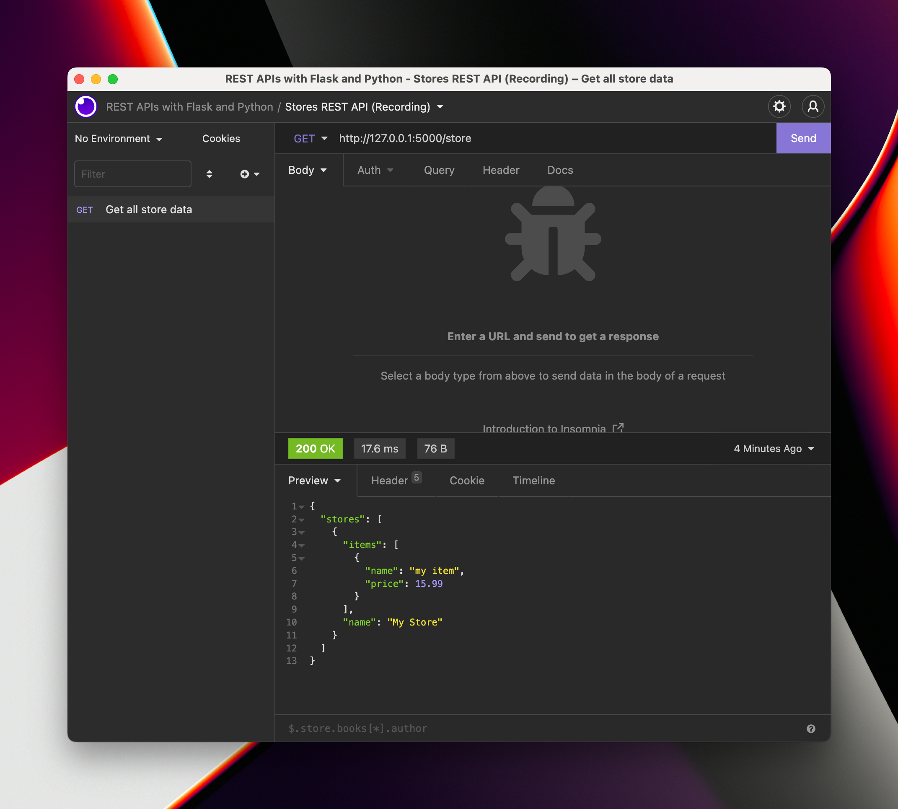

# How to run a Docker container

## Install Docker Desktop

Docker Desktop is an application to help you manage your images and containers. Download it and install it here: [https://www.docker.com/products/docker-desktop/](https://www.docker.com/products/docker-desktop/).

## Create your Docker image

Next, download the REST API code from Section 3. You can download it [here](https://www.dropbox.com/s/qs28amk2h420f2y/s03-final-code.zip?dl=0).

If you want to use the code you wrote while following the videos, that's fine! Just make sure it works by running the Flask app locally and testing it with Insomnia REST Client or Postman.

### Write the `Dockerfile`

In your project folder (i.e. the same folder as `app.py`), we're going to write the Dockerfile.

To do this, make a file called `Dockerfile`.

:::caution
Make sure the file is called `Dockerfile`, and not `Dockerfile.txt` or anything like that!
:::

Inside the `Dockerfile` we're going to write this:

```dockerfile
FROM python:3.10
EXPOSE 5000
WORKDIR /app
RUN pip install flask
COPY . .
CMD ["flask", "run", "--host", "0.0.0.0"]
```

Here's a quick breakdown of what each line does:

1. `FROM python:3.10` uses the `python:3.10` image as a base.
2. `EXPOSE 5000` is basically documentation[^1]. It tells the user of the Dockerfile that port 5000 is something the running container will use.
3. `WORKDIR /app` does it so everything we do in the Docker image will happen in the image's `/app` directory.
4. `RUN pip install flask` runs a command in the image. Here the command is `pip install flask`, which is what we need to run our app.
5. `COPY . .` is a bit cryptic! It copies everything in the current folder (so `app.py`) into the image's current folder (so `/app`).
6. `CMD ["flask", "run", "--host", "0.0.0.0"]` tells the image what command to run when you start a container. Here the command is `flask run --host=0.0.0.0`.

:::tip
We need `--host=0.0.0.0` to make Docker be able to do port forwarding, as otherwise the Flask app will only be accessible within the container, but not outside the container.
:::

Now we need to create the Docker image.

We do this with the `docker build` command in the terminal.

:::caution
Make sure to restart your terminal after installing Docker Desktop, so that you have access to the `docker` program in your terminal.
:::

Open a terminal (in VSCode that's CMD+J or CTRL+J), and run this command:

```
docker build -t rest-apis-flask-python .
```

The `-t rest-apis-flask-python` flag is optional, but tags the image, giving it a name. It can be handy for later! The final `.` at the end of the command is not a mistake; it tells the command _what_ to build. The `.` means "the current directory".

This command can take a while to run as it needs to download the `python:3.10` image first. You should see quite a lot of output while the command runs.

When the command is finished, you should see this (among other things):

```
 => [2/4] WORKDIR /app                                                                             0.4s
 => [3/4] RUN pip install flask                                                                    2.9s
 => [4/4] COPY . .                                                                                 0.0s
 => exporting to image                                                                             0.1s
 => => exporting layers                                                                            0.1s
 => => writing image sha256:d9a68a03f868e74bca48567dfc9a0b702d1618941a71b77de12ff14e908ba155       0.0s
 => => naming to docker.io/library/rest-apis-first-rest-api                                        0.0s
```

And now your image is built! You should be able to see it in the "Images" section of your Docker Desktop app.

## Run the Docker container

When we start a Docker container from this image, it will run the `flask run` command. Remember that by default, `flask run` starts a Flask app using port 5000.

But the container's ports are not accessible from outside the container by default. We need to tell Docker that when we access a certain port in our computer, those requests and responses should be forwarded to a certain port in our container.

So we'll run the container, but we must remember to forward a port (e.g. 5000) in our computer to port 5000 in the container

To do so, run this command:

```
docker run -d -p 5000:5000 rest-apis-flask-python
```

We're passing a few things to `docker run`:

1. `-d` runs the container in the background, so that you can close the terminal and the container keeps running.
2. `-p 5000:5000` maps port 5000 in your computer to port 5000 in the container.
3. `rest-apis-flask-python` is the image tag that you want to run.

You should see something like this as your output:

```
9f3c564ac64a1723069dda0e80becb70d3697d4bfcbcb626cd5add0c65df173f
```

That's the ID of the container. If you're not using Docker Desktop, you need this ID in order to stop the container later (with `docker rm 9f3c564`, that's the first few characters of the ID).

And now, if everything has worked, you should be able to access the Flask app _just as if it was running without Docker_!

:::caution Did something not work?
A common error can happen when the port that you tried to forward isn't available (e.g. because something else is already running):

```
docker: Error response from daemon: driver failed programming external connectivity on endpoint bold_goldwasser (ff58b1755c1d1d0fd6b1dd4f59ab3b903b0e68f320624c4a2495672a735039d5): Bind for 0.0.0.0:5000 failed: port is already allocated.
```

You have two options: either figure out what is running on port 5000 and shut it down before trying again, or you can change the port that you want to use in your computer:

```
docker run -dp 5001:5000 rest-apis-flask-python
```
:::

Try making requests using the URL `127.0.0.1:5000` with Insomnia REST Client or Postman, and you should see it working well!



[^1]: [Docker `EXPOSE` command (Official Documentation)](https://docs.docker.com/engine/reference/builder/#expose)