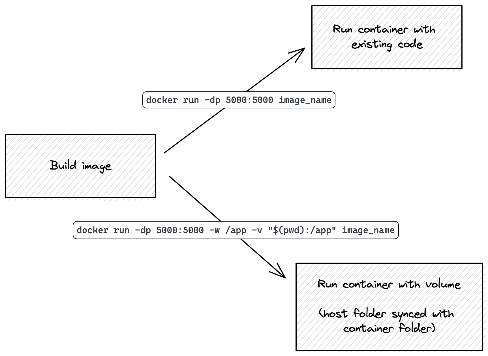

# Improvements to our first REST API

- [x] Set metadata above
- [x] Start writing!
- [x] Create `start` folder
- [x] Create `end` folder
- [ ] Create per-file diff between `end` and `start` (use "Compare Folders")

## Starting code from section 4

This is the "First REST API" project from Section 4:

import Tabs from '@theme/Tabs';
import TabItem from '@theme/TabItem';

<div className="codeTabContainer">
<Tabs>
<TabItem value="app" label="app.py" default>

```py title="app.py"
import uuid
from flask import Flask, request

app = Flask(__name__)

stores = {}
items = {}


@app.get("/item/<string:item_id>")
def get_item(item_id):
    try:
        return items[item_id]
    except KeyError:
        return {"message": "Item not found"}, 404


@app.post("/items")
def create_item():
    request_data = request.get_json()
    new_item_id = uuid.uuid4().hex
    new_item = {
        "name": request_data["name"],
        "price": request_data["price"],
        "store_id": request_data["store_id"],
    }
    items[new_item_id] = new_item
    return new_item


@app.get("/items")
def get_all_items():
    return {"items": list(items.value())}


@app.get("/stores/<string:store_id>")
def get_store(store_id):
    try:
        # Here you might also want to add the items in this store
        # We'll do that later on in the course
        return stores[store_id]
    except KeyError:
        return {"message": "Store not found"}, 404


@app.post("/stores")
def create_store():
    request_data = request.get_json()
    new_store_id = uuid.uuid4().hex
    new_store = {"id": new_store_id, "name": request_data["name"]}
    stores[new_store_id] = new_store
    return new_store, 201


@app.get("/stores")
def get_all_stores():
    return {"stores": list(stores.value())}
```

</TabItem>
<TabItem value="docker" label="Dockerfile">

```docker
FROM python:3.10
EXPOSE 5000
WORKDIR /app
RUN pip install flask
COPY . .
CMD ["flask", "run", "--host", "0.0.0.0"]
```

</TabItem>
</Tabs>
</div>


## New files

Let's start off by creating a `requirements.txt` file with all our dependencies:

```txt title="requirements.txt"
flask
flask-smorest
python-dotenv
```

We're adding `flask-smorest` to help us write REST APIs more easily, and generate documentation for us.

We're adding `python-dotenv` so it's easier for us to load environment variables and use the `.flaskenv` file.

Next, let's create the `.flaskenv` file:

```txt title=".flaskenv"
FLASK_APP=app
FLASK_ENV=development
```

If we have the `python-dotenv` library installed, when we run the `flask run` command, Flask will read the variables inside `.flaskenv` and use them to configure the Flask app.

The configuration that we'll do is to define the Flask app file (here, `app.py`). Then we'll also set the Flask environment to `development`, which does a couple things:

- Sets debug mode to true, which makes the app give us better error messages
- Sets the app reloading to true, so the app restarts when we make code changes

We don't want debug mode to be enabled in production (when we deploy our app), but while we're doing development it's definitely a time-saving tool!

## Code improvements

### Creating a database file

First of all, let's move our "database" to another file.

Create a `db.py` file with the following content:

```py title="db.py"
stores = {}
items = {}
```

And delete those corresponding lines from `app.py`.

Then, import the `stores` and `items` variables from `db.py` in `app.py`:

```py title="app.py"
from db import stores, items
```

### Using `flask_smorest.abort` instead of returning errors manually

At the moment in our API we're doing things like these in case of an error:

```py title="app.py"
@app.get("/stores/<string:store_id>")
def get_store(store_id):
    try:
        # Here you might also want to add the items in this store
        # We'll do that later on in the course
        return stores[store_id]
    except KeyError:
        # highlight-start
        return {"message": "Store not found"}, 404
        # highlight-end
```

A small improvement we can do on this is use the `abort` function from Flask-Smorest, which helps us write these messages and include a bit of extra information too.

Add this import at the top of `app.py`:

```py title="app.py"
from flask_smorest import abort
```

And then let's change our error returns to use `abort`:

```py title="app.py"
@app.get("/item/<string:item_id>")
def get_item(item_id):
    try:
        return items[item_id]
    except KeyError:
        # highlight-start
        abort(404, message="Item not found.")
        # highlight-end
```

And here:

```py title="app.py"
@app.get("/stores/<string:store_id>")
def get_store(store_id):
    try:
        # Here you might also want to add the items in this store
        # We'll do that later on in the course
        return stores[store_id]
    except KeyError:
        # highlight-start
        abort(404, message="Store not found.")
        # highlight-end
```

### Adding error handling on creating items and stores

At the moment when we create items and stores, we _expect_ there to be certain items in the JSON body of the request.

If those items are missing, the app will return an error 500, which means "Internal Server Error".

Instead of that, it's good practice to return an error 400 and a message telling the client what went wrong.

To do so, let's inspect the body of the request and see if it contains the data we need.

Let's change our `create_item()` function to this:

```py title="app.py"
@app.post("/items")
def create_item():
    item_data = request.get_json()
    # Here not only we need to validate data exists,
    # But also what type of data. Price should be a float,
    # for example.
    if (
        "price" not in item_data
        or "store_id" not in item_data
        or "name" not in item_data
    ):
        abort(
            400,
            message="Bad request. Ensure 'price', 'store_id', and 'name' are included in the JSON payload.",
        )
    for item in items.values():
        if (
            item_data["name"] == item["name"]
            and item_data["store_id"] == item["store_id"]
        ):
            abort(400, message=f"Item already exists.")

    item_id = uuid.uuid4().hex
    item = {**item_data, "id": item_id}
    items[item_id] = item

    return item
```

And our `create_store()` function to this:

```py title="app.py"
@app.post("/stores")
def create_store():
    store_data = request.get_json()
    if "name" not in store_data:
        abort(
            400,
            message="Bad request. Ensure 'name' is included in the JSON payload.",
        )
    for store in stores.values():
        if store_data["name"] == store["name"]:
            abort(400, message=f"Store already exists.")

    store_id = uuid.uuid4().hex
    store = {**store_data, "id": store_id}
    stores[store_id] = store

    return store
```

## New endpoints

We want to add some endpoints for added functionality:

- `DELETE /items/<string:item_id>` so we can delete items from the database.
- `PUT /items/<string:item_id>` so we can update items.
- `DELETE /stores/<string:store_id>` so we can delete stores.

### Deleting items

This is almost identical to getting items, but we use the `del` keyword to remove the entry from the dictionary.

```py title="app.py"
@app.delete("/items/<string:item_id>")
def delete_item(item_id):
    try:
        del items[item_id]
        return {"message": "Item deleted."}
    except KeyError:
        abort(404, message="Item not found.")
```

### Updating items

This is almost identical to creating items, but in this API we've decided to not let item updates change the `store_id` of the item. So clients can change item name and price, but not the store that the item belongs to.

This is an API design decision, and you could very well allow clients to update the `store_id` if you want!

```py title="app.py"
@app.put("/items/<string:item_id>")
def update_item(item_id):
    item_data = request.get_json()
    # There's  more validation to do here!
    # Like making sure price is a number, and also both items are optional
    # You should also prevent keys that aren't 'price' or 'name' to be passed
    # Difficult to do with an if statement...
    if "price" not in item_data or "name" not in item_data:
        abort(
            400,
            message="Bad request. Ensure 'price', and 'name' are included in the JSON payload.",
        )
    try:
        item = items[item_id]
        item |= item_data

        return item
    except KeyError:
        abort(404, message="Item not found.")
```

:::tip Dictionary update operators
The `|=` syntax is a new dictionary operator. You can read more about it [here](https://blog.teclado.com/python-dictionary-merge-update-operators/).
:::

### Deleting stores

This is very similar to deleting items!

```py title="app.py"
@app.delete("/stores/<string:store_id>")
def delete_store(store_id):
    try:
        del stores[store_id]
        return {"message": "Store deleted."}
    except KeyError:
        abort(404, message="Store not found.")
```

## Reloading the Flask app on Docker when we change the code

Up to now, we've been re-building the Docker image and re-running the container each time we make a code change.

This is a bit of a time sink, and a bit annoying to do! Let's do it so that the Docker container runs the code that we're editing. That way, when we make a change to the code, the Flask app should restart and use the new code.

All we have to do is:

1. Build the Docker image
2. Run the image, but replace the contents of the image's `/app` directory (where the code is) by the contents of our source code folder in the host machine.

So, first build the Docker image:

```
docker build -t flask-smorest-api .
```

Once that's done, the image has an `/app` directory which contains the source code as it was copied from the host machine during the build stage.

So at this point, we _can_ run a container from this image, and it will run the app _as it was when it was built_:

```
docker run -dp 5000:5000 flask-smorest-api
```

This should just work, and you can try it out in the Insomnia REST Client to make sure the endpoints all work.

But like we said earlier, when we make changes to the code we'll have to rebuild and rerun.

So instead, what we can do is run the image, but replace the image's `/app` directory with the host's source code folder.

That will cause the source code to change in the Docker container while it's running. And, since we've ran Flask with debug mode on, the Flask app will automatically restart when the code changes.

To do so, stop the running container (if you have one running), and use this command instead:

```
docker run -dp 5000:5000 -w /app -v "$(pwd):/app" flask-smorest-api
```

- `-dp 5000:5000` - same as before. Run in detached (background) mode and create a port mapping.
- `-w /app` - sets the container's present working directory where the command will run from.
- `-v "$(pwd):/app"` - bind mount (link) the host's present directory to the container's `/app` directory. Note: Docker requires absolute paths for binding mounts, so in this example we use `pwd` for printing the absolute path of the working directory instead of typing it manually.
- `flask-smorest-api` - the image to use.

And with this, your Docker container now is running the code as shown in your IDE. Plus, since Flask is running with debug mode on, the Flask app will restart when you make code changes!

:::info
Using this kind of volume mapping only makes sense _during development_. When you share your Docker image or deploy it, you won't be sharing anything from the host to the container. That's why it's still important to include the original source code in the image when you build it.
:::

Just to recap, here are the two ways we've seen to run your Docker container:

