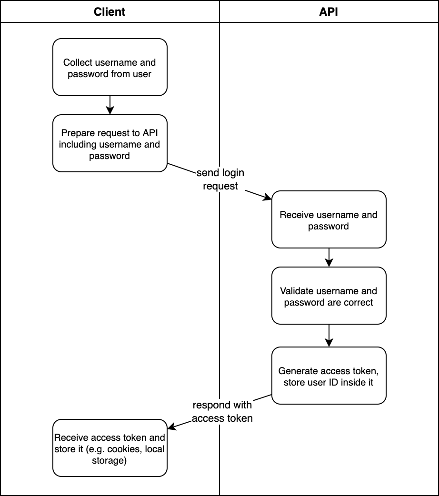
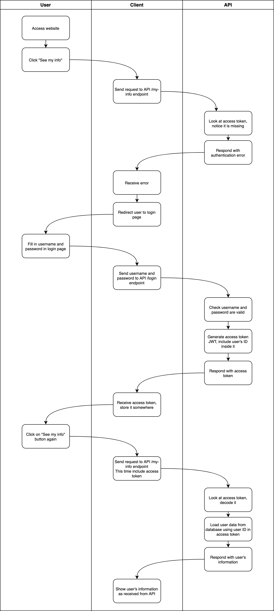

# How are JWTs used?

:::info JWT vs. Access token?
An "access token" is any piece of information that a client can use to authenticate. In this API, we use JWTs. Therefore you can say that the JWT and the access token are one and the same!
:::

We've learned that a JWT is generated by the API and sent to the client. When the client wants to login they will send the API information that allows them to do so: usually, the user's username and password. The API then validates that this login information is correct, and generates the access token.

Inside the access token, the API stores identifying information for the user. Then the access token is sent to the client who stores it in whichever way they see fit. In every subsequent request to the API, the client should include the access token. That way, just with that information, the API can tell _who_ made the request. The API can decode the access token and see inside it the identifying information for the user for whom the access token was generated.

Here is a diagram of the interaction between client and API to generate an access token:

## An example of using access tokens

For example, let's say you want to make an API that has an endpoint `/my-info`. This endpoint should send the client information about the currently logged-in user.

Let's imagine that **the client** is a website. In the website, there is a button, "See my info", which when clicked sends a request to the API's `/my-info` endpoint to get the logged-in user's information.

### Clicking the button without logging in

If the user navigates to the website and clicks the "See my info" button, the website will send a request to the API. Because the user hasn't logged in yet, the website doesn't have an access token generated for this user.

Therefore, the API responds with an "authentication error".

The website receives the authentication error and that tells it that the user hasn't logged in. So the website can show the user a log-in form, for the user to enter their username and password.

When the user enters their username and password, the website will send a request to the API's `/login` endpoint. The API then responds with the access token. The website stores the access token for use later.

If the user clicks the "See my info" button again, now the website will include the access token in the request.

The server will then:

1. See the access token.
2. Decode it.
3. Look at what user the access token was generated for.
4. Load _that_ user's information from the database.
5. Respond with that user's information.

The website receives the user's information, and can display it.

This is why the user sees their own information, and not someone else's. The access token was generated after they logged in with their details, and the access token stores their user ID. The server will use that to retrieve the correct data.

Here is a rather long diagram depicting what happens:

:::warning This course deals only with the API
Remember that in this course, we're making the API. We are not concerned with the client! We don't care how the client stores the access token or even whether the client is a website, mobile app, Postman or Insomnia, or anything else!
:::

## When do users provide their username and password?

Access tokens don't last forever: they normally have expiry times within 30 days of being generated. The shorter the expiry time of an access token, the more often that the user has to re-authenticate by providing their username and password, but the more secure the token is.

Tokens are more secure if they expire sooner because if the user forgets to log out of a shared device, and someone else tries to use their account, the token will expire and they will be unable to use the account.

Obviously, it's not a great experience for users if they have to keep re-entering their username and password constantly. Towards the end of this section we will learn about [token refreshing](../12_token_refreshing_flask_jwt_extended/README.md), which is a way to reduce the amount of times users have to re-authenticate, without affecting security too much.
