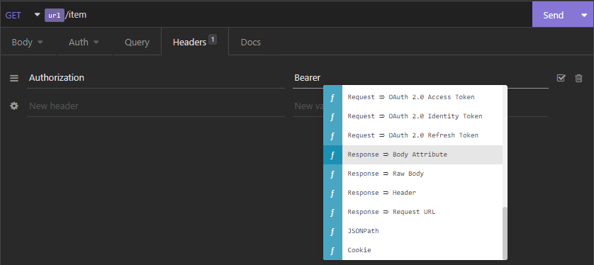
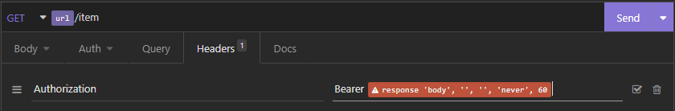
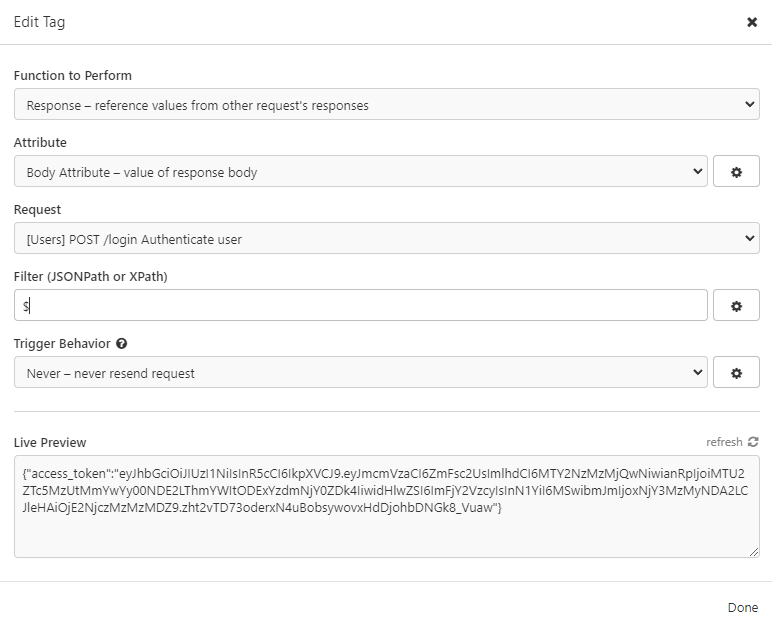
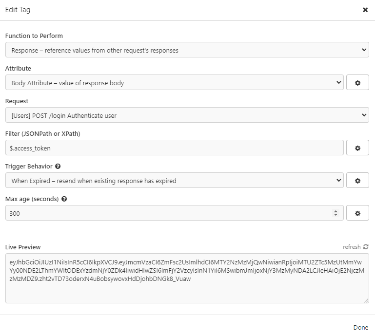
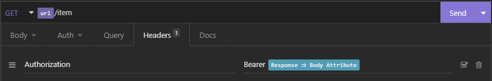
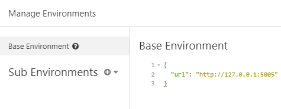

# Request chaining with Insomnia

Up until now, we've been able to log in, get an access token, and then use that acces token to access the protected endpoints in our API. However, this workflow is a bit tedious, and we have to copy-paste the access token into every request. Luckily, Insomnia has a feature called [request chaining](https://support.insomnia.rest/article/26-request-chaining) that allows us to simplify this workflow!

## How to use request chaining with Insomnia

Instead of passing the JWT in every request, you can access the `Headers`  section and follow these steps. In the `Authorization` field, type `Bearer` add a space and then press `CTRL + SPACE` to get a contextual menu. Navigate to the `Response -> Body Attribute` field and select it, as shown in the screenshot below:

After you've selected it, you'll see an error that looks like this:

If you click on the error, you'll see a modal window:

Inside of this window, you will first need to select a request that you want to get the data from. Click on `Select item` inside the `Request` field and choose the `POST /login` endpoint. After you've done that, go to the `Filter` field. In this field, we are telling Insomnia which part of the response we want to get from it. The prompt is started with the dollar sign `$` and then we can use the dot to access the attributes of the response. If we only type `$` or `$.`, we'll get a list of all the attributes of the response:

In our case, we want to get the `access_token` attribute from the response, so we type `$.access_token`. If there was something else inside the `access_token` that you wanted to access like some value for example, you could do `$.access_token.value` and so on. After you've added the filter, you can set the `Trigger Behavior`. For example, you can set it to `When expired` and set time to 300 seconds. This means that the token will be refreshed every 5 minutes. The filled out window should look like this:

You can now press `Done` and you'll see that the error is gone and that the `Authorization` field is filled out with the `Bearer` token:

Since we use multiple protected endpoints, we would need to use the same method to get the `access_token` for every request. To tackle this problem, we can use [environment variables](https://support.insomnia.rest/article/13-environment-variables), as we did before for the `url` variable.

To do this, you need to create a new environment variable. Click on the `No Environment` button in the top left corner of the Insomnia window and then click on the `Manage Environments` button, you will see a base environment that looks like this:

Add a new environment variable called `access_token`, and for its value you should follow the same process from above. As a quick reminder, you should press `CTRL + SPACE` to get the contextual menu and then select the `Response -> Body Attribute` field. Click on the error that will show up and fill out the modal window as we've done before. Make sure to wrap the `Response -> Body Attribute` with quotation marks, as shown in the screenshot. When the variable is created, your environment should look like this:

You will now be able to use this environment variable in all of the endpoints by simply writing `{{access_token}}` in the field that you want to use it in. Coming back to the first example, you can use the access token in the `Authorization` field by writing `Bearer {{access_token}}` and this will be the result:

If you try and make the request, you will see that it works just like before, without needing to copy and paste the access token.
