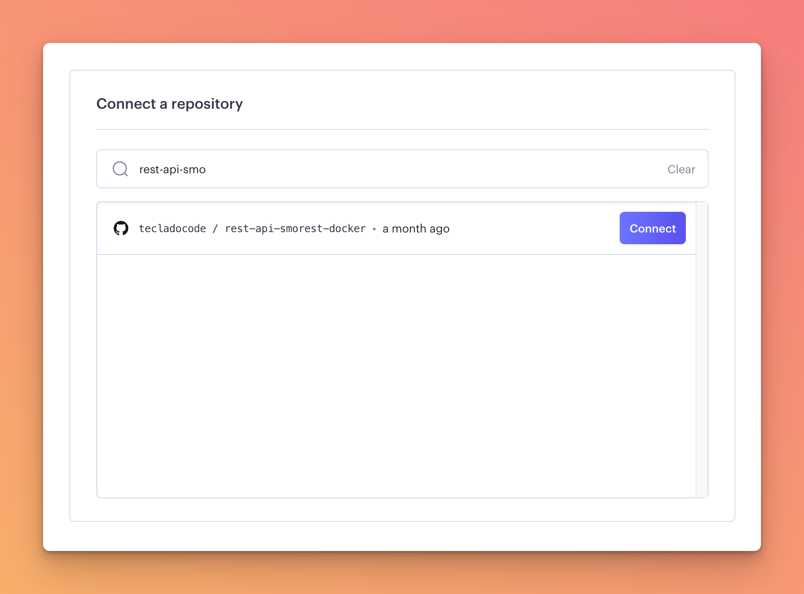
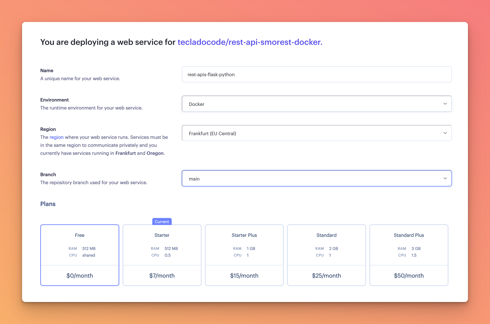
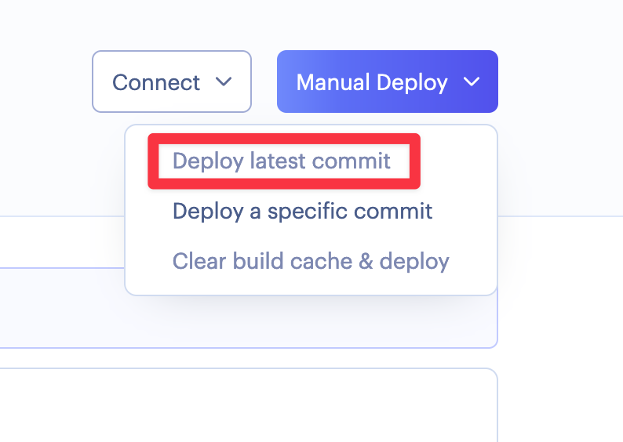
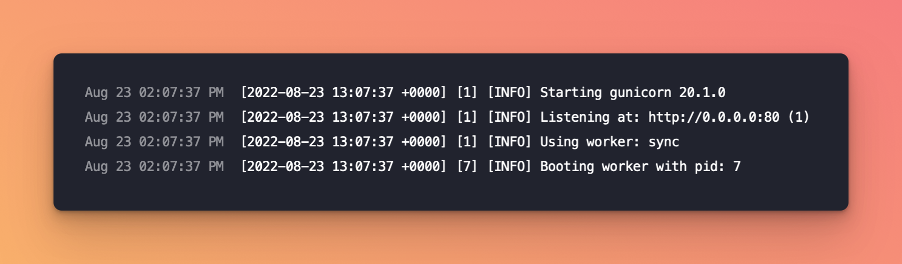

# Creating a Render.com web service

Let's start by going to [https://render.com](https://render.com) and signing up to an account. You can "Log in with GitHub" to make things easier.

Once you've logged in, you'll see in your [Dashboard](https://dashboard.render.com/services) that you can create a new service using a button at the top right of the page.

Click it, and select "Web Service".

Options other than "Web Service" are useful for different kinds of applications, and some are databases that you can use (but not for free, so we won't use Render for our database in this section).

Then you'll [connect your GitHub account](https://render.com/docs/github) if you haven't already, and look for your repositories.

Select the repository that you created during this course:

Then, give it a name and make sure the configuration is as follows:

- Make sure "Docker" is selected.
- Select a server location close to you. I'm near Frankfurt, but if you are in the US or Asia you might want to choose a different one so it's faster to connect to.
- Select the "Free" server option.

At the bottom of the service there is an "Advanced" section which you can use to further configure your service. We'll talk more about that in a bit.

For now, hit "Create Web Service" and wait for it to deploy your code from GitHub!

If you navigate to your Dashboard and then click through to your newly created service, you'll be able to see the service details. If it isn't already deploying, click on the "Manual Deploy" button on the top right to initiate a deploy of the latest commit:

Then you should start seeing logs appear detailing the deployment process!

While on the free plan, deployments are a bit slow. It has to build your image and run it! Give it a few minutes, until the deployment succeeds. You should see this:

Now, you can access your service URL and try it out using Insomnia or Postman!

:::warning
Free services in Render.com shut down after inactivity for a few minutes. If you don't use your service for a few minutes, it will shut down and it will need to restart, which can take a minute! This is one of the limitations of their free plan.
:::
