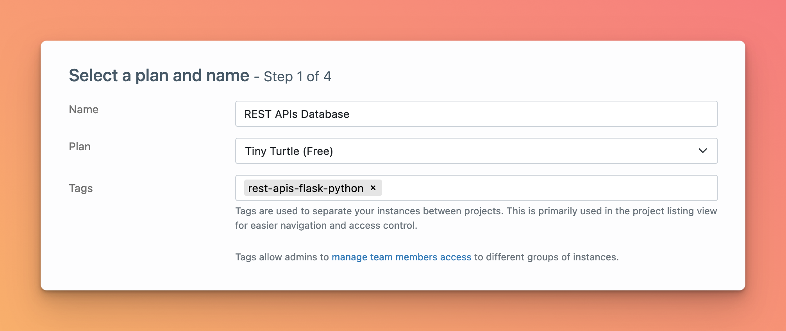
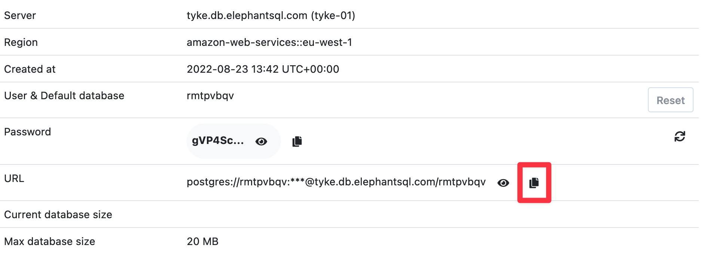

# How to get a deployed PostgreSQL database for our app

There are many PostgreSQL-as-a-Service providers (that means, services that handle creating and maintaining your database for you).

Render.com offers PostgreSQL, and the pricing is actually quite fair. However, the free tier is limited and you can only use it for a certain amount of time.

That's why I recommend using ElephantSQL for your free PostgreSQL needs. When you go over the free ElephantSQL limits, then you can use the Render.com database instead.

To get a free ElephantSQL PostgreSQL database, just go to their site, sign up, and then create a database in a region close to your Render.com server. Make sure to select the free tier.

Once you've got this, you should be able to see the Database URL:

Copy this, as you'll need it in the next lecture!
