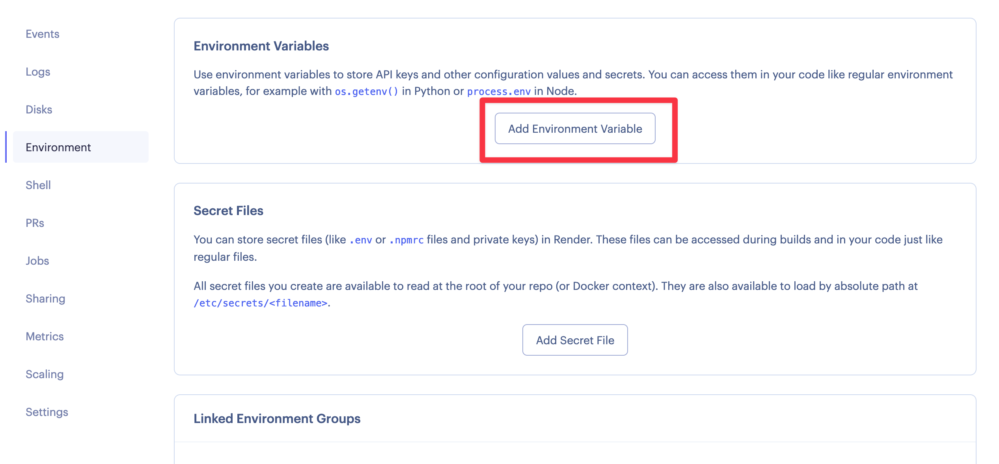
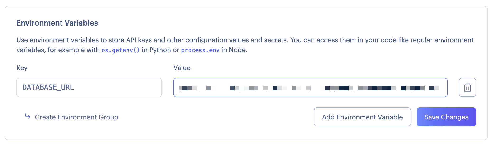

# How to use Environment Variables in Render.com

A common way to configure applications before they start up is by using environment variables.

We can define environment variables in our computers, and also in our servers, and of course they can be different in each.

That's what's interesting about them: we can define an environment variable locally for our database, which may be `sqlite:///data.db`. Then in our server we can define the same variable, but with a value of the ElephantSQL Database URL.

Since we are using SQLAlchemy in our application, it doesn't care whether it's connecting to SQLite or PostgreSQL. So all we have to do to use a different database is change the connection string.

Let's begin by using environment variables locally.

## Using PostgreSQL locally

Since we are going to be using PostgreSQL when we deploy, it's a good idea to use PostgreSQL also locally. That's because SQLite and PostgreSQL behave a bit differently, so if we use SQLite locally and PostgreSQL in production, we may come across issues.

To work with PostgreSQL locally, you can run a PostgreSQL container using Docker, you can install PostgreSQL locally, or you can create another ElephantSQL database for local development.

I would do the last option. That way, you'll have 2 ElephantSQL databases; one for production and one for development.

## How to use environment variables locally with our Flask app

First let's install `psycopg2` and add it to our `requirements.txt` file:

```text title="requirements.txt"
flask
flask-smorest
python-dotenv
sqlalchemy
flask-sqlalchemy
flask-jwt-extended
passlib
flask-migrate
gunicorn
# highlight-start
psycopg2
# highlight-end
```

Then, let's create a new file called `.env`. In this file, we can store any environment variables we want. We can then "load" these variables when we start the app.

```text title=".env"
DATABASE_URL=postgresql://YOUR_DEVELOPMENT_URL
```

:::warning
The ElephantSQL URL starts with `postgres://...`. Make sure to change it so it starts with `postgresql://...`!
:::

With the file created, we can load it when we start our Flask app:

```python title="app.py"
# highlight-start
import os
# highlight-end
from flask import Flask, jsonify
from flask_smorest import Api
from flask_jwt_extended import JWTManager
# highlight-start
from dotenv import load_dotenv
# highlight-end

from db import db
from blocklist import BLOCKLIST

from resources.user import blp as UserBlueprint
from resources.item import blp as ItemBlueprint
from resources.store import blp as StoreBlueprint
from resources.tag import blp as TagBlueprint


def create_app(db_url=None):
    app = Flask(__name__)
    # highlight-start
    load_dotenv()
    # highlight-end
    app.config["API_TITLE"] = "Stores REST API"
    app.config["API_VERSION"] = "v1"
    app.config["OPENAPI_VERSION"] = "3.0.3"
    app.config["OPENAPI_URL_PREFIX"] = "/"
    app.config["OPENAPI_SWAGGER_UI_PATH"] = "/swagger-ui"
    app.config[
        "OPENAPI_SWAGGER_UI_URL"
    ] = "https://cdn.jsdelivr.net/npm/swagger-ui-dist/"
    # highlight-start
    app.config["SQLALCHEMY_DATABASE_URI"] = db_url or os.getenv("DATABASE_URL", "sqlite:///data.db")
    # highlight-end
    app.config["SQLALCHEMY_TRACK_MODIFICATIONS"] = False
    app.config["PROPAGATE_EXCEPTIONS"] = True
    db.init_app(app)
    api = Api(app)
```

Highlighted are four lines which we must change.

1. First we `import os`. We'll need this to access environment variables.
2. Second, we import the `load_dotenv` function, which we'll need to run in order to turn the contents of the `.env` file into environment variables.
3. We actually run the `load_dotenv` function.
4. We'll use `db_url` if provided, otherwise we'll retrieve the environment variable's value. If there is no environment value, the default will be `"sqlite:///data.db"`.

Notice that our Flask app has two ways to be configured: with the `db_url` argument, or via environment variables. You would normally use `db_url` when writing automated tests for your application. While we don't do that in this course, it's a good habit to get into!

:::warning
Do not include your `.env` file in your GitHub repository! Add it to `.gitignore` so you don't include it accidentally.
:::

Since we can't include `.env` in our GitHub repository, we should do something to make sure that new developers know that they should create a `.env` file when they clone the repository.

We normally do this by creating a file called `.env.example`. This file should only contain the environment variable definitions, but not the values:

```text title=".env.example"
DATABASE_URL=
```

You should add `.env.example` to your repository.

## Changes needed to our app code for PostgreSQL

We've been working with SQLite all this time, and PostgreSQL behaves a bit differently. There are a couple of changes we need to make to our app at this point:

1. Make sure all foreign keys are the same data type as the primary keys they reference.
2. Change the length constraint on user passwords from `80` to `256`.

This is because SQLite doesn't enforce either of these constraints, so although they were a problem before, we didn't know because SQLite didn't tell us about it. PostgreSQL will complain!

### Changes to foreign keys

The only foreign key that was mistakenly given the wrong data type was in the `TagModel`. This is the necessary change:

```python title="models/tag.py"
from db import db


class TagModel(db.Model):
    __tablename__ = "tags"

    id = db.Column(db.Integer, primary_key=True)
    name = db.Column(db.String(80), unique=False, nullable=False)
    # highlight-start
    store_id = db.Column(db.Integer, db.ForeignKey("stores.id"), nullable=False)
    # highlight-end

    store = db.relationship("StoreModel", back_populates="tags")
    items = db.relationship("ItemModel", back_populates="tags", secondary="items_tags")
```

We also need to change the database migration file that creates the store ID:

```python title="migrations/versions/07006e31e788_.py"
...

op.create_table('tags',
    sa.Column('id', sa.Integer(), nullable=False),
    sa.Column('name', sa.String(length=80), nullable=False),
    # highlight-start
    sa.Column('store_id', sa.Integer(), nullable=False),
    # highlight-end
    sa.ForeignKeyConstraint(['store_id'], ['stores.id'], ),
    sa.PrimaryKeyConstraint('id'),
    sa.UniqueConstraint('name')
    )

...
```

Now, let's run the migrations so that our development ElephantSQL database is created. Remember to make sure that your development ElephantSQL database is empty before starting the migrations.

```bash
flask db upgrade
```

### Changes to password length

In the `UserModel`, we'll make this change:

```python title="models/user.py"
from db import db


class UserModel(db.Model):
    __tablename__ = "users"

    id = db.Column(db.Integer, primary_key=True)
    username = db.Column(db.String(80), unique=True, nullable=False)
    # highlight-start
    password = db.Column(db.String(256), nullable=False)
    # highlight-end
```

### Running our migration with string length changes

Now we want to create a new migration so that our changes to the `UserModel` will be applied. But because we're changing the length of a string column, we need to first make a modification to the Alembic configuration.

The changes we want to make are to add `compare_type=True`[^alembic_docs] in both `context.configure()` calls:

```python title="migrations/env.py"
from __future__ import with_statement

import logging
from logging.config import fileConfig

from flask import current_app

from alembic import context

# this is the Alembic Config object, which provides
# access to the values within the .ini file in use.
config = context.config

# Interpret the config file for Python logging.
# This line sets up loggers basically.
fileConfig(config.config_file_name)
logger = logging.getLogger('alembic.env')

# add your model's MetaData object here
# for 'autogenerate' support
# from myapp import mymodel
# target_metadata = mymodel.Base.metadata
config.set_main_option(
    'sqlalchemy.url',
    str(current_app.extensions['migrate'].db.get_engine().url).replace(
        '%', '%%'))
target_metadata = current_app.extensions['migrate'].db.metadata

# other values from the config, defined by the needs of env.py,
# can be acquired:
# my_important_option = config.get_main_option("my_important_option")
# ... etc.


def run_migrations_offline():
    """Run migrations in 'offline' mode.

    This configures the context with just a URL
    and not an Engine, though an Engine is acceptable
    here as well.  By skipping the Engine creation
    we don't even need a DBAPI to be available.

    Calls to context.execute() here emit the given string to the
    script output.

    """
    url = config.get_main_option("sqlalchemy.url")
    context.configure(
        url=url,
        target_metadata=target_metadata,
        # highlight-start
        compare_type=True,
        # highlight-end
        literal_binds=True
    )

    with context.begin_transaction():
        context.run_migrations()


def run_migrations_online():
    """Run migrations in 'online' mode.

    In this scenario we need to create an Engine
    and associate a connection with the context.

    """

    # this callback is used to prevent an auto-migration from being generated
    # when there are no changes to the schema
    # reference: http://alembic.zzzcomputing.com/en/latest/cookbook.html
    def process_revision_directives(context, revision, directives):
        if getattr(config.cmd_opts, 'autogenerate', False):
            script = directives[0]
            if script.upgrade_ops.is_empty():
                directives[:] = []
                logger.info('No changes in schema detected.')

    connectable = current_app.extensions['migrate'].db.get_engine()

    with connectable.connect() as connection:
        context.configure(
            connection=connection,
            target_metadata=target_metadata,
            process_revision_directives=process_revision_directives,
            # highlight-start
            compare_type=True,
            # highlight-end
            **current_app.extensions['migrate'].configure_args,
        )

        with context.begin_transaction():
            context.run_migrations()


if context.is_offline_mode():
    run_migrations_offline()
else:
    run_migrations_online()

```

Next, let's create the new migration:

```bash
flask db migrate
```

This may add a couple other data type changes, such as changing `REAL` to `Float`. This is due to how types are assigned differently between SQLite and PostgreSQL. Make sure that the password length change is in the migration:

```python title="migrations/versions/36e961f62882_.py"
op.alter_column('users', 'password',
    existing_type=sa.VARCHAR(length=80),
    type_=sa.String(length=256),
    existing_nullable=False)
```

## Running database migrations in production

So we've created our migration files and we've migrated our development database. What about our production database?

We _could_ simply change our `.env` file, connect to production, and migrate that database. But then we'd need to remember to do that every time before we deploy, and it simply isn't feasible.

Instead, we want a solution where the database migrations run before the app starts. That way, it will be impossible for us to forget to run the migrations when we deploy.

To do so, we'll tell the Docker container to run the database migrations before starting the `gunicorn` process. It's more straightforward than it sounds!

First let's write a very short bash script that runs the migrations, and then starts the gunicorn process:

```bash title="docker-entrypoint.sh"
#!/bin/sh

flask db upgrade

exec gunicorn --bind 0.0.0.0:80 "app:create_app()"
```

Then, let's modify our `Dockerfile` to use that script:

```dockerfile
FROM python:3.10
WORKDIR /app
COPY requirements.txt .
RUN pip install --no-cache-dir --upgrade -r requirements.txt
COPY . .
# highlight-start
CMD ["/bin/bash", "docker-entrypoint.sh"]
# highlight-end
```

:::tip
If you want to run the Docker container locally with the Flask development server, our [previous instructions](/docs/deploy_to_render/docker_with_gunicorn/#run-the-docker-container-locally-with-the-flask-development-server-and-debugger) are still good. You won't be applying the migrations, but most of the time that won't be a problem.
:::

Commit the changes, and push them to GitHub. We'll need these changes so we can use environment variables in Render.com.

## How to add environment variables to Render.com

Now that our Flask app is using environment variables, all we have to do is add the `DATABASE_URL` environment variable to our Render.com service, and then deploy the latest changes from our GitHub repository.

To add environment variables in Render.com, go to the service settings and then on the left you'll see "Environment":



Click on "Add Environment Variable", and there put `DATABASE_URL` as the key, and your ElephantSQL Database URL as the value:



:::warning
Again, make sure to use `postgresql://...` here.
:::

Now, do another manual deploy of the latest commit.

When this is done, your app should be saving to the ElephantSQL database, and it will apply the migrations before starting up!

[^alembic_docs]: [Compare Types (Alembic official documentation)](https://alembic.sqlalchemy.org/en/latest/autogenerate.html#compare-types)