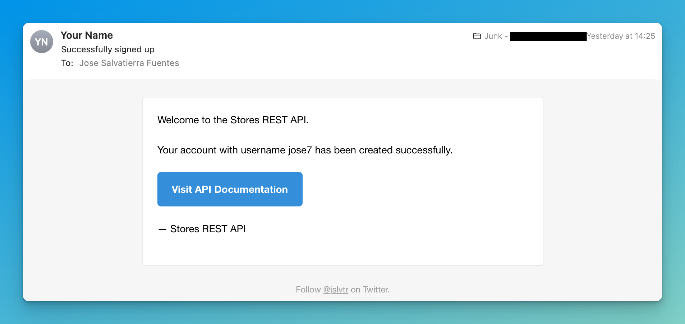

# Sending HTML emails with Mailgun

Until now, we've been sending exclusively text emails. These have a clear advantage: text is simple! They'll look the same in every email client and device, and for many things, text is good enough.

However, I'll be the first to say that it doesn't look amazing. You're at the mercy of the default font family and size of the recipient's email client, and you can't personalize the email with your business branding.

This is where HTML emails come into play.

HTML emails require that we write HTML instead of text, and also CSS for the styling. We should still keep the text version of the email, just in case the recipient's email client doesn't render HTML for whatever reason.

## Writing HTML emails

Crafting HTML emails is difficult! Every email client renders things slightly differently and supports different versions of the HTML and CSS specs.

For example, it's discouraged to use CSS Flex when writing emails, because many email clients don't support it.

That's why you'll see most HTML emails use HTML tables for their layout 🤮

Fortunately for us, Mailgun provides a few [HTML templates](https://www.mailgun.com/blog/email/transactional-html-email-templates/) that we can simply copy, paste, and modify. They test these HTML templates to make sure they render correctly in most email clients, and they come with CSS already written.

## Getting the Mailgun HTML email templates

This link has a writeup of how HTML templates work: [https://www.mailgun.com/blog/email/transactional-html-email-templates/](https://www.mailgun.com/blog/email/transactional-html-email-templates/).

You can find their templates here: [https://github.com/mailgun/transactional-email-templates/tree/master/templates/inlined](https://github.com/mailgun/transactional-email-templates/tree/master/templates/inlined).

There are three different transactional email templates, and we'll be using the [`action.html`](https://raw.githubusercontent.com/mailgun/transactional-email-templates/master/templates/inlined/action.html) template in this lecture for our "user registration" email.

## Adding the template to our application

Create a `templates/email/action.html` file in your project, and place the entire raw code of the `action.html` file from the Mailgun repository.

:::tip
Make sure to grab the [**raw** code](https://raw.githubusercontent.com/mailgun/transactional-email-templates/master/templates/inlined/action.html) to make sure there are no GitHub artefacts in the code.
:::

The copied [`action.html`](https://github.com/mailgun/transactional-email-templates/blob/master/templates/inlined/action.html) code from the [Mailgun repository](https://github.com/mailgun/transactional-email-templates) (below) is licensed with the MIT license. Please see the [repository license](https://github.com/mailgun/transactional-email-templates/blob/master/LICENSE) for more information.

```html title="templates/email/action.html"
<!DOCTYPE html PUBLIC "-//W3C//DTD XHTML 1.0 Transitional//EN" "http://www.w3.org/TR/xhtml1/DTD/xhtml1-transitional.dtd">
<html xmlns="http://www.w3.org/1999/xhtml" style="font-family: 'Helvetica Neue', Helvetica, Arial, sans-serif; box-sizing: border-box; font-size: 14px; margin: 0;">
<head>
<meta name="viewport" content="width=device-width" />
<meta http-equiv="Content-Type" content="text/html; charset=UTF-8" />
<title>Actionable emails e.g. reset password</title>


<style type="text/css">
img {
max-width: 100%;
}
body {
-webkit-font-smoothing: antialiased; -webkit-text-size-adjust: none; width: 100% !important; height: 100%; line-height: 1.6em;
}
body {
background-color: #f6f6f6;
}
@media only screen and (max-width: 640px) {
  body {
    padding: 0 !important;
  }
  h1 {
    font-weight: 800 !important; margin: 20px 0 5px !important;
  }
  h2 {
    font-weight: 800 !important; margin: 20px 0 5px !important;
  }
  h3 {
    font-weight: 800 !important; margin: 20px 0 5px !important;
  }
  h4 {
    font-weight: 800 !important; margin: 20px 0 5px !important;
  }
  h1 {
    font-size: 22px !important;
  }
  h2 {
    font-size: 18px !important;
  }
  h3 {
    font-size: 16px !important;
  }
  .container {
    padding: 0 !important; width: 100% !important;
  }
  .content {
    padding: 0 !important;
  }
  .content-wrap {
    padding: 10px !important;
  }
  .invoice {
    width: 100% !important;
  }
}
</style>
</head>

<body itemscope itemtype="http://schema.org/EmailMessage" style="font-family: 'Helvetica Neue',Helvetica,Arial,sans-serif; box-sizing: border-box; font-size: 14px; -webkit-font-smoothing: antialiased; -webkit-text-size-adjust: none; width: 100% !important; height: 100%; line-height: 1.6em; background-color: #f6f6f6; margin: 0;" bgcolor="#f6f6f6">

<table class="body-wrap" style="font-family: 'Helvetica Neue',Helvetica,Arial,sans-serif; box-sizing: border-box; font-size: 14px; width: 100%; background-color: #f6f6f6; margin: 0;" bgcolor="#f6f6f6"><tr style="font-family: 'Helvetica Neue',Helvetica,Arial,sans-serif; box-sizing: border-box; font-size: 14px; margin: 0;"><td style="font-family: 'Helvetica Neue',Helvetica,Arial,sans-serif; box-sizing: border-box; font-size: 14px; vertical-align: top; margin: 0;" valign="top"></td>
		<td class="container" width="600" style="font-family: 'Helvetica Neue',Helvetica,Arial,sans-serif; box-sizing: border-box; font-size: 14px; vertical-align: top; display: block !important; max-width: 600px !important; clear: both !important; margin: 0 auto;" valign="top">
			<div class="content" style="font-family: 'Helvetica Neue',Helvetica,Arial,sans-serif; box-sizing: border-box; font-size: 14px; max-width: 600px; display: block; margin: 0 auto; padding: 20px;">
				<table class="main" width="100%" cellpadding="0" cellspacing="0" itemprop="action" itemscope itemtype="http://schema.org/ConfirmAction" style="font-family: 'Helvetica Neue',Helvetica,Arial,sans-serif; box-sizing: border-box; font-size: 14px; border-radius: 3px; background-color: #fff; margin: 0; border: 1px solid #e9e9e9;" bgcolor="#fff"><tr style="font-family: 'Helvetica Neue',Helvetica,Arial,sans-serif; box-sizing: border-box; font-size: 14px; margin: 0;"><td class="content-wrap" style="font-family: 'Helvetica Neue',Helvetica,Arial,sans-serif; box-sizing: border-box; font-size: 14px; vertical-align: top; margin: 0; padding: 20px;" valign="top">
							<meta itemprop="name" content="Confirm Email" style="font-family: 'Helvetica Neue',Helvetica,Arial,sans-serif; box-sizing: border-box; font-size: 14px; margin: 0;" /><table width="100%" cellpadding="0" cellspacing="0" style="font-family: 'Helvetica Neue',Helvetica,Arial,sans-serif; box-sizing: border-box; font-size: 14px; margin: 0;"><tr style="font-family: 'Helvetica Neue',Helvetica,Arial,sans-serif; box-sizing: border-box; font-size: 14px; margin: 0;"><td class="content-block" style="font-family: 'Helvetica Neue',Helvetica,Arial,sans-serif; box-sizing: border-box; font-size: 14px; vertical-align: top; margin: 0; padding: 0 0 20px;" valign="top">
										Please confirm your email address by clicking the link below.
									</td>
								</tr><tr style="font-family: 'Helvetica Neue',Helvetica,Arial,sans-serif; box-sizing: border-box; font-size: 14px; margin: 0;"><td class="content-block" style="font-family: 'Helvetica Neue',Helvetica,Arial,sans-serif; box-sizing: border-box; font-size: 14px; vertical-align: top; margin: 0; padding: 0 0 20px;" valign="top">
										We may need to send you critical information about our service and it is important that we have an accurate email address.
									</td>
								</tr><tr style="font-family: 'Helvetica Neue',Helvetica,Arial,sans-serif; box-sizing: border-box; font-size: 14px; margin: 0;"><td class="content-block" itemprop="handler" itemscope itemtype="http://schema.org/HttpActionHandler" style="font-family: 'Helvetica Neue',Helvetica,Arial,sans-serif; box-sizing: border-box; font-size: 14px; vertical-align: top; margin: 0; padding: 0 0 20px;" valign="top">
										<a href="http://www.mailgun.com" class="btn-primary" itemprop="url" style="font-family: 'Helvetica Neue',Helvetica,Arial,sans-serif; box-sizing: border-box; font-size: 14px; color: #FFF; text-decoration: none; line-height: 2em; font-weight: bold; text-align: center; cursor: pointer; display: inline-block; border-radius: 5px; text-transform: capitalize; background-color: #348eda; margin: 0; border-color: #348eda; border-style: solid; border-width: 10px 20px;">Confirm email address</a>
									</td>
								</tr><tr style="font-family: 'Helvetica Neue',Helvetica,Arial,sans-serif; box-sizing: border-box; font-size: 14px; margin: 0;"><td class="content-block" style="font-family: 'Helvetica Neue',Helvetica,Arial,sans-serif; box-sizing: border-box; font-size: 14px; vertical-align: top; margin: 0; padding: 0 0 20px;" valign="top">
										&mdash; The Mailgunners
									</td>
								</tr></table></td>
					</tr></table><div class="footer" style="font-family: 'Helvetica Neue',Helvetica,Arial,sans-serif; box-sizing: border-box; font-size: 14px; width: 100%; clear: both; color: #999; margin: 0; padding: 20px;">
					<table width="100%" style="font-family: 'Helvetica Neue',Helvetica,Arial,sans-serif; box-sizing: border-box; font-size: 14px; margin: 0;"><tr style="font-family: 'Helvetica Neue',Helvetica,Arial,sans-serif; box-sizing: border-box; font-size: 14px; margin: 0;"><td class="aligncenter content-block" style="font-family: 'Helvetica Neue',Helvetica,Arial,sans-serif; box-sizing: border-box; font-size: 12px; vertical-align: top; color: #999; text-align: center; margin: 0; padding: 0 0 20px;" align="center" valign="top">Follow <a href="http://twitter.com/mail_gun" style="font-family: 'Helvetica Neue',Helvetica,Arial,sans-serif; box-sizing: border-box; font-size: 12px; color: #999; text-decoration: underline; margin: 0;">@Mail_Gun</a> on Twitter.</td>
						</tr></table></div></div>
		</td>
		<td style="font-family: 'Helvetica Neue',Helvetica,Arial,sans-serif; box-sizing: border-box; font-size: 14px; vertical-align: top; margin: 0;" valign="top"></td>
	</tr></table></body>
</html>
```

Now we can easily modify this file to suit our needs. Here are the changes I'll make:

```diff title="templates/email/action.html"
 <head>
 <meta name="viewport" content="width=device-width" />
 <meta http-equiv="Content-Type" content="text/html; charset=UTF-8" />
-<title>Actionable emails e.g. reset password</title>
+<title>Welcome to Stores REST API</title>
 
 
 <style type="text/css">
@@ -64,22 +64,22 @@ background-color: #f6f6f6;
 			<div class="content" style="font-family: 'Helvetica Neue',Helvetica,Arial,sans-serif; box-sizing: border-box; font-size: 14px; max-width: 600px; display: block; margin: 0 auto; padding: 20px;">
 				<table class="main" width="100%" cellpadding="0" cellspacing="0" itemprop="action" itemscope itemtype="http://schema.org/ConfirmAction" style="font-family: 'Helvetica Neue',Helvetica,Arial,sans-serif; box-sizing: border-box; font-size: 14px; border-radius: 3px; background-color: #fff; margin: 0; border: 1px solid #e9e9e9;" bgcolor="#fff"><tr style="font-family: 'Helvetica Neue',Helvetica,Arial,sans-serif; box-sizing: border-box; font-size: 14px; margin: 0;"><td class="content-wrap" style="font-family: 'Helvetica Neue',Helvetica,Arial,sans-serif; box-sizing: border-box; font-size: 14px; vertical-align: top; margin: 0; padding: 20px;" valign="top">
 							<meta itemprop="name" content="Confirm Email" style="font-family: 'Helvetica Neue',Helvetica,Arial,sans-serif; box-sizing: border-box; font-size: 14px; margin: 0;" /><table width="100%" cellpadding="0" cellspacing="0" style="font-family: 'Helvetica Neue',Helvetica,Arial,sans-serif; box-sizing: border-box; font-size: 14px; margin: 0;"><tr style="font-family: 'Helvetica Neue',Helvetica,Arial,sans-serif; box-sizing: border-box; font-size: 14px; margin: 0;"><td class="content-block" style="font-family: 'Helvetica Neue',Helvetica,Arial,sans-serif; box-sizing: border-box; font-size: 14px; vertical-align: top; margin: 0; padding: 0 0 20px;" valign="top">
-										Please confirm your email address by clicking the link below.
+										Welcome to the Stores REST API.
 									</td>
 								</tr><tr style="font-family: 'Helvetica Neue',Helvetica,Arial,sans-serif; box-sizing: border-box; font-size: 14px; margin: 0;"><td class="content-block" style="font-family: 'Helvetica Neue',Helvetica,Arial,sans-serif; box-sizing: border-box; font-size: 14px; vertical-align: top; margin: 0; padding: 0 0 20px;" valign="top">
-										We may need to send you critical information about our service and it is important that we have an accurate email address.
+										Your account has been created successfully.
 									</td>
 								</tr><tr style="font-family: 'Helvetica Neue',Helvetica,Arial,sans-serif; box-sizing: border-box; font-size: 14px; margin: 0;"><td class="content-block" itemprop="handler" itemscope itemtype="http://schema.org/HttpActionHandler" style="font-family: 'Helvetica Neue',Helvetica,Arial,sans-serif; box-sizing: border-box; font-size: 14px; vertical-align: top; margin: 0; padding: 0 0 20px;" valign="top">
-										<a href="http://www.mailgun.com" class="btn-primary" itemprop="url" style="font-family: 'Helvetica Neue',Helvetica,Arial,sans-serif; box-sizing: border-box; font-size: 14px; color: #FFF; text-decoration: none; line-height: 2em; font-weight: bold; text-align: center; cursor: pointer; display: inline-block; border-radius: 5px; text-transform: capitalize; background-color: #348eda; margin: 0; border-color: #348eda; border-style: solid; border-width: 10px 20px;">Confirm email address</a>
+										<a href="http://127.0.0.1:5000/swagger-ui" class="btn-primary" itemprop="url" style="font-family: 'Helvetica Neue',Helvetica,Arial,sans-serif; box-sizing: border-box; font-size: 14px; color: #FFF; text-decoration: none; line-height: 2em; font-weight: bold; text-align: center; cursor: pointer; display: inline-block; border-radius: 5px; text-transform: capitalize; background-color: #348eda; margin: 0; border-color: #348eda; border-style: solid; border-width: 10px 20px;">Visit API Documentation</a>
 									</td>
 								</tr><tr style="font-family: 'Helvetica Neue',Helvetica,Arial,sans-serif; box-sizing: border-box; font-size: 14px; margin: 0;"><td class="content-block" style="font-family: 'Helvetica Neue',Helvetica,Arial,sans-serif; box-sizing: border-box; font-size: 14px; vertical-align: top; margin: 0; padding: 0 0 20px;" valign="top">
-										&mdash; The Mailgunners
+										&mdash; Stores REST API
 									</td>
 								</tr></table></td>
 					</tr></table><div class="footer" style="font-family: 'Helvetica Neue',Helvetica,Arial,sans-serif; box-sizing: border-box; font-size: 14px; width: 100%; clear: both; color: #999; margin: 0; padding: 20px;">
-					<table width="100%" style="font-family: 'Helvetica Neue',Helvetica,Arial,sans-serif; box-sizing: border-box; font-size: 14px; margin: 0;"><tr style="font-family: 'Helvetica Neue',Helvetica,Arial,sans-serif; box-sizing: border-box; font-size: 14px; margin: 0;"><td class="aligncenter content-block" style="font-family: 'Helvetica Neue',Helvetica,Arial,sans-serif; box-sizing: border-box; font-size: 12px; vertical-align: top; color: #999; text-align: center; margin: 0; padding: 0 0 20px;" align="center" valign="top">Follow <a href="http://twitter.com/mail_gun" style="font-family: 'Helvetica Neue',Helvetica,Arial,sans-serif; box-sizing: border-box; font-size: 12px; color: #999; text-decoration: underline; margin: 0;">@Mail_Gun</a> on Twitter.</td>
+					<table width="100%" style="font-family: 'Helvetica Neue',Helvetica,Arial,sans-serif; box-sizing: border-box; font-size: 14px; margin: 0;"><tr style="font-family: 'Helvetica Neue',Helvetica,Arial,sans-serif; box-sizing: border-box; font-size: 14px; margin: 0;"><td class="aligncenter content-block" style="font-family: 'Helvetica Neue',Helvetica,Arial,sans-serif; box-sizing: border-box; font-size: 12px; vertical-align: top; color: #999; text-align: center; margin: 0; padding: 0 0 20px;" align="center" valign="top">Follow <a href="http://twitter.com/jslvtr" style="font-family: 'Helvetica Neue',Helvetica,Arial,sans-serif; box-sizing: border-box; font-size: 12px; color: #999; text-decoration: underline; margin: 0;">@jslvtr</a> on Twitter.</td>
 						</tr></table></div></div>
 		</td>
 		<td style="font-family: 'Helvetica Neue',Helvetica,Arial,sans-serif; box-sizing: border-box; font-size: 14px; vertical-align: top; margin: 0;" valign="top"></td>
 	</tr></table></body>
-</html>
+</html>
```

:::tip
Instead of sending users to 127.0.0.1:5000, make sure to use your Render.com deployed URL!
:::

This is good, and it'll look nice already! But we can do better. Let's personalize the email a bit so that users see what username they signed up with.

To do this personalization, I'll use the Jinja templating language, since it gets installed alongside Flask.

```diff title="templates/email/action.html"
    </tr><tr style="font-family: 'Helvetica Neue',Helvetica,Arial,sans-serif; box-sizing: border-box; font-size: 14px; margin: 0;"><td class="content-block" style="font-family: 'Helvetica Neue',Helvetica,Arial,sans-serif; box-sizing: border-box; font-size: 14px; vertical-align: top; margin: 0; padding: 0 0 20px;" valign="top">
-   We may need to send you critical information about our service and it is important that we have an accurate email address.
+   Your account with username {{ username }} has been created successfully.
        </td>
    </tr>
```

## Rendering our template before sending the email

Now that we've written our HTML template, we need to pass it through the Jinja templating language, to replace that `{{ username }}` with the actual user's username.

Let's do this in `tasks.py`.

First let's import `jinja2` and set it up so it can load template files from the `templates` folder (new code is highlighted):

```py title="tasks.py"
...

# highlight-start
import jinja2
# highlight-end

load_dotenv()

DOMAIN = os.getenv("MAILGUN_DOMAIN")
# highlight-start
template_loader = jinja2.FileSystemLoader("templates")
template_env = jinja2.Environment(loader=template_loader)


def render_template(template_filename, **context):
    return template_env.get_template(template_filename).render(**context)
# highlight-end

...
```

Then let's modify our `send_simple_message` function so that it accepts an html body as well as text:

```py title="tasks.py"
# highlight-start
def send_simple_message(to, subject, body, html):
# highlight-end
    return requests.post(
        f"https://api.mailgun.net/v3/{DOMAIN}/messages",
        auth=("api", os.getenv("MAILGUN_API_KEY")),
        data={
            "from": f"Jose Salvatierra <mailgun@{DOMAIN}>",
            "to": [to],
            "subject": subject,
            "text": body,
            # highlight-start
            "html": html,
            # highlight-end
        },
    )
```

And finally, let's pass in the rendered template when we call this function:

```py title="tasks.py"
def send_user_registration_email(email, username):
    return send_simple_message(
        email,
        "Successfully signed up",
        f"Hi {username}! You have successfully signed up to the Stores REST API.",
        # highlight-start
        render_template("email/registration.html", username=username),
        # highlight-end
    )
```

Now remember to restart your app _and_ your background worker, then try to register a user (you may have to delete the existing user first so you don't get duplicate emails).

You should get the HTML email delivered!



:::info Spam or junk?
If your emails are going to spam, it's likely because you're using the sandbox domain. When you use an actual domain, you have to go through various [domain verification steps](https://help.mailgun.com/hc/en-us/articles/360011702394-Why-Do-My-Emails-Go-to-Spam-) which reduce the likelihood of your emails ending up in spam.
:::
