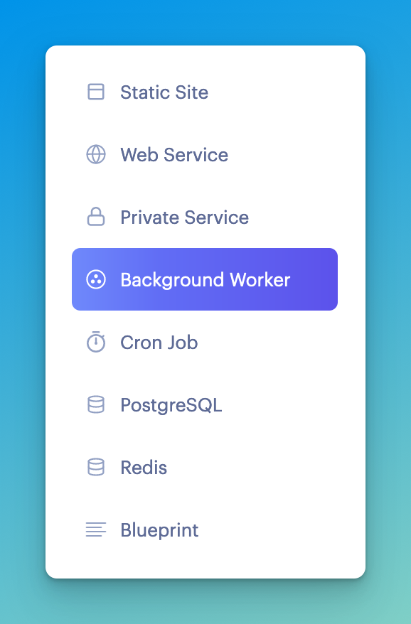
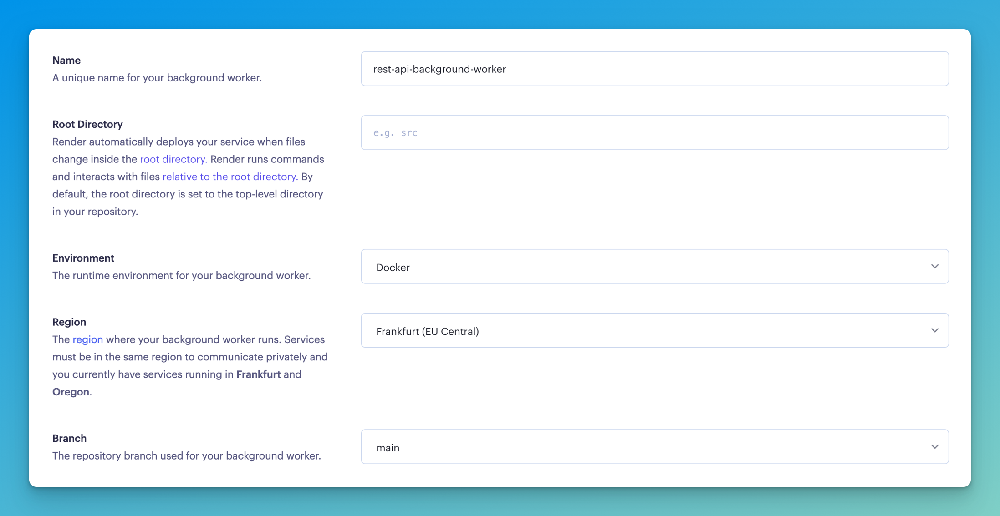
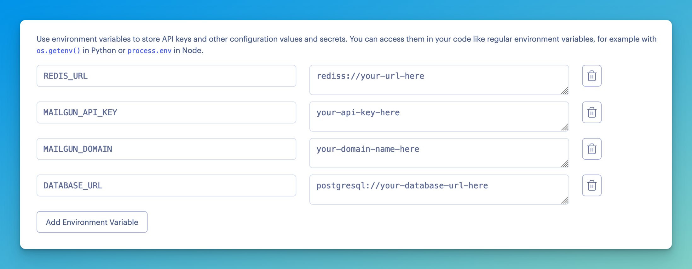
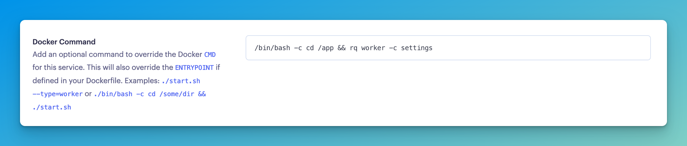

# Deploy the rq background worker to Render.com

When deploying to Render.com, it's much easier if we don't have to pass the `REDIS_URL` and the queue name directly to the command.

So instead, let's create a `settings.py` file and put our `rq` worker configuration there:

```python title="settings.py"
import os
from dotenv import load_dotenv

load_dotenv()

REDIS_URL = os.getenv("REDIS_URL", "redis://localhost:6379")
QUEUES = ["emails", "default"]
```

The names of the variables are important, see [the documentation](https://python-rq.org/docs/workers/#using-a-config-file) for all the options that are currently supported.

To run the `rq` worker using this settings file use `rq worker -c settings`.

Let's add this to our repo, and then deploy the background worker to Render.com.

First create a new background worker:



Then, give it a name and fill in its basic settings. The default works for the most part. Make sure it's in the same region as or close to your Postgres and Redis databases:



Add the environment variables it needs. Although in this case it doesn't need the `DATABASE_URL`, you can add it if you will be adding other tasks that do use the database in the near future. If not, leave it out.

:::warning Internal URL
If your Redis database is with Render.com, you'd want to use the Redis database **Internal URL**, but I encountered some issues with it where the `redis` package didn't recognise the URL. Try it, but fall back to the external URL if it doesn't work.
:::



Finally, this "background worker" is just a Python program without networking capabilities. So if we leave it as is, it will actually just run our Dockerfile and the Dockerfile's `CMD` command (which starts our web application). Therefore we want to give it a custom Docker command that starts the background worker.

In that command, I'll go into the `/app` directory of the Docker container, and run the `rq` worker passing in the `settings.py` file.

The command is `/bin/bash -c cd /app && rq worker -c settings`.

This is what it looks like in Render.com:

