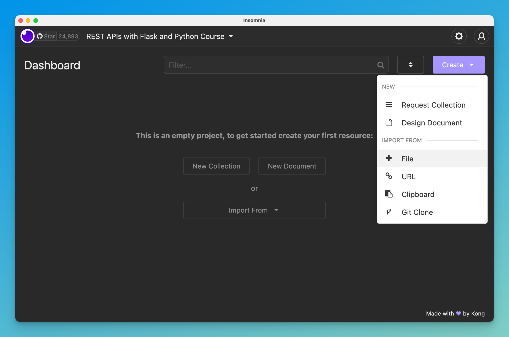
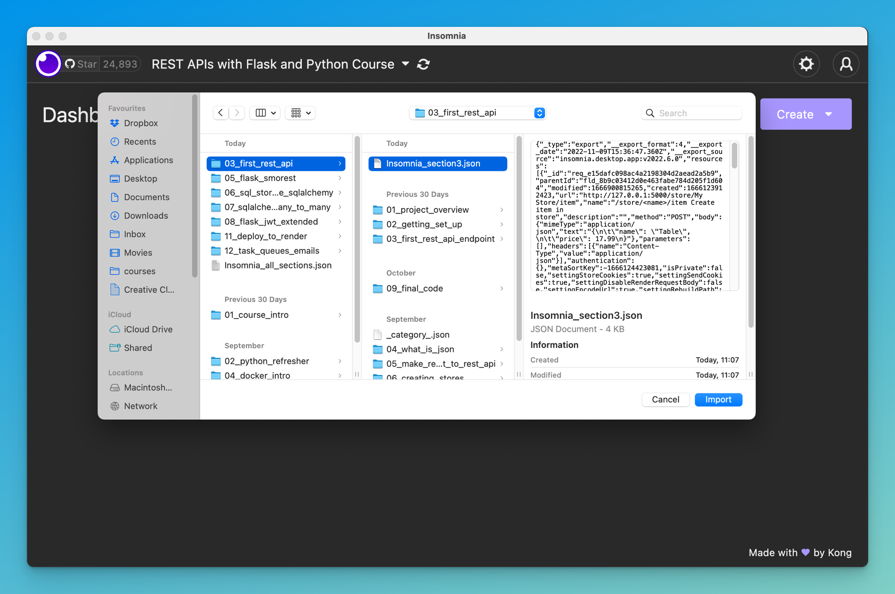
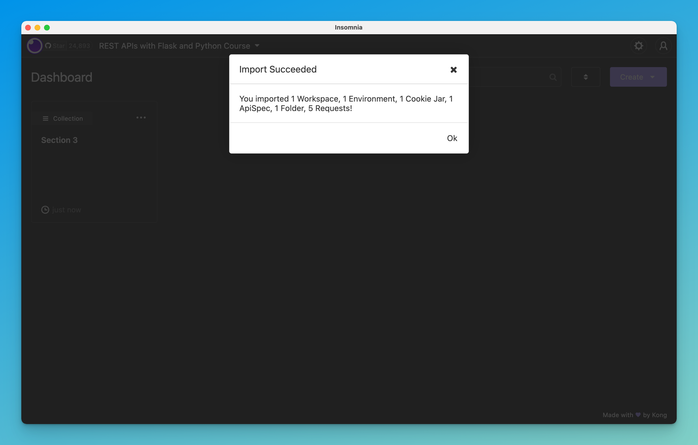
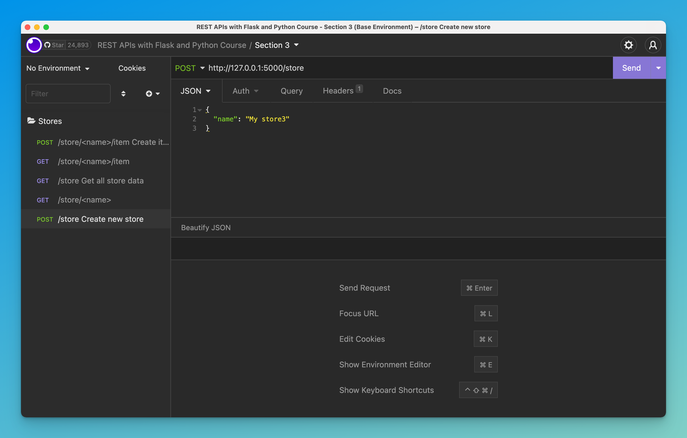
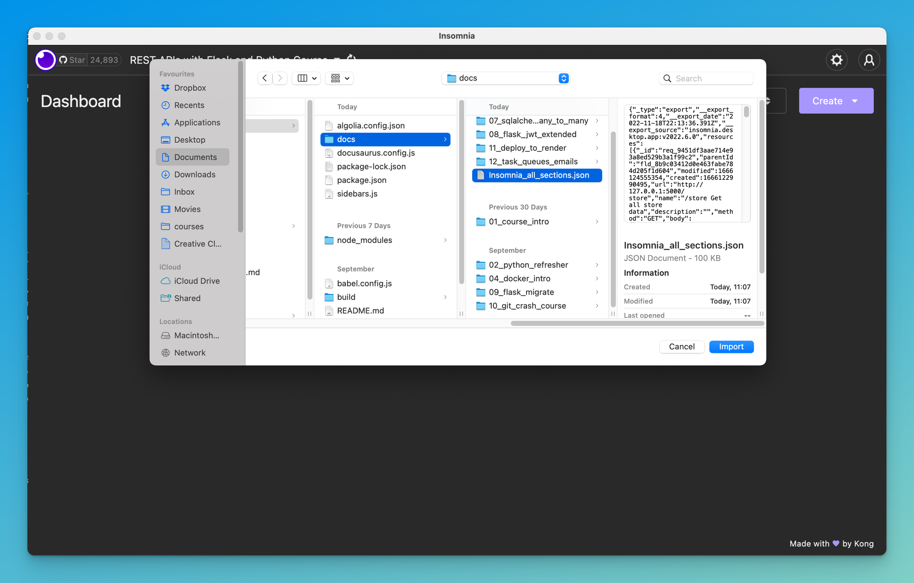
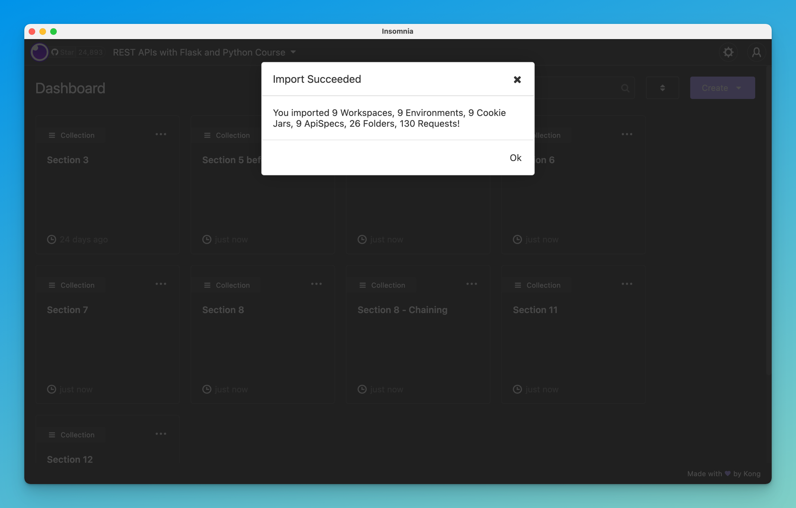

# Insomnia Files for this course

In this course, we use [Insomnia](https://insomnia.rest/) to test our REST API as we develop it. It's a great tool, and relatively straightforward to use!

To make it easier for you, we've prepared a few files that you can import directly into your Insomnia app. Each section has its own file, and there's also a file which contains [all sections](#all-section-file-project).

:::tip Get the files
You can download the entire GitHub repository as a .zip file ([see how here](https://github.com/tecladocode/rest-apis-flask-python#getting-started)). Then, extract it and you'll be able to find the JSON files for Insomnia.
:::

## Per-section files (collections)

Every section where we change the API endpoints, we've prepared an Insomnia file you can import. To import the file, just go to your Insomnia project, click on the "Create" button, and select "Import from file".

Then, find the appropriate file and you should see the request collection being created. Files are in each section folder where API changes were introduced, and they are named `Insomnia_sectionX.json`.

The Insomnia project should now show your new collection:

Clicking on it should let you access the requests, which may be inside folders.

## All-section file (project)

To import all sections at the same time, you can use the all-section file. It's in the `docs/docs/` folder of the repository, and it's called [`Insomnia_all_sections.json`](https://github.com/tecladocode/rest-apis-flask-python/blob/develop/docs/docs/Insomnia_all_sections.json).

To import it, follow the same process as before but using this file. It will create multiple request collections.

First, find the `Insomnia_all_sections.json` file when importing:

This should import the request collections for all sections:

That's it! With this, you can either import sections individually, or all sections together to follow the entire course.

Now let's start with the [course content](/docs/course_intro/)!