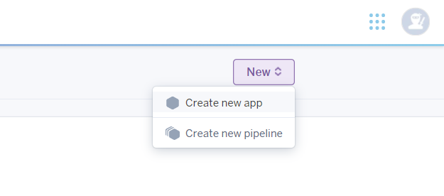
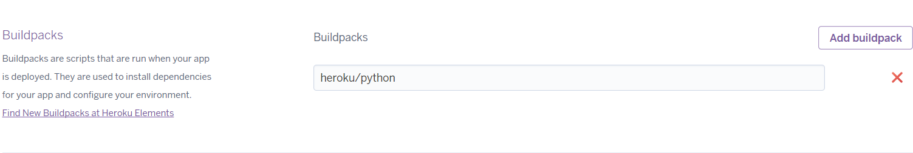
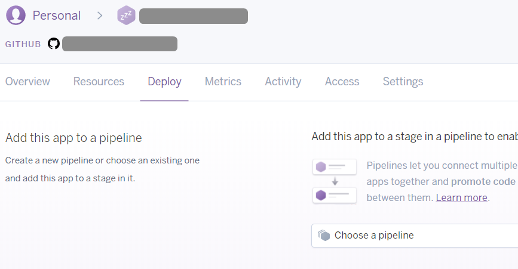
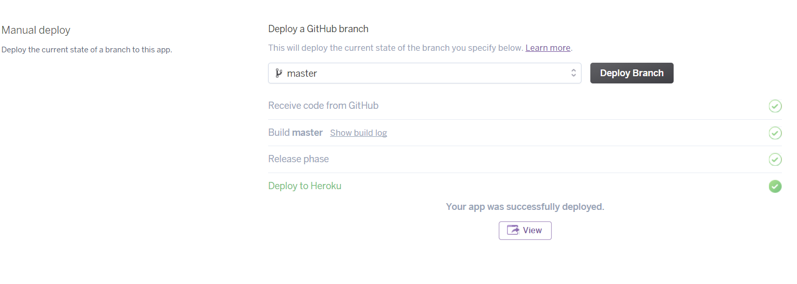

# Overview

In this tutorial, we will introduce a popular cloud application platform called Heroku. We will briefly describe [what Heroku is](Heroku%20Tutorial.md#what-is-heroku) and [how to use it](Heroku%20Tutorial.md#deploying-our-app-onto-heroku).

# What is Heroku

Heroku is a cloud platform for deploying and running modern apps. A more detailed Introduction can be found [here](https://www.heroku.com/platform).

Some of the key advantages of Heroku include:
- No server side knowledge is required, so it is easy to set up.
- It can be free, but the free tier has some limitations, which we will discuss later when we introduce [`Dyno`](Heroku%20Tutorial.md#creating-a-heroku-dyno).
- It enables SSL so the communication between your app and its users are encrypted.


# Deploying our app onto Heroku

In this section, we will describe in length on how to deploy our app onto Heroku.

## Preparing our code

Before we start deploying our app into Heroku, we need to make some preparation:
- We will be using GitHub to store our application source code and make it available for Heroku.
- We need to add a few files to allow Heroku to understand and run our application.

We will explain exactly how to do it in this section.

### Getting our sample app from GitHub

In this tutorial, we assume you know the basics on Git and GitHub, and that you have experience in setting up a GitHub repository and push your code onto it. If you have no idea what Git or GitHub is about, do not worry. [Here is a good video tutorial on how to use Git and GitHub](https://www.youtube.com/watch?v=SWYqp7iY_Tc).

If you wished to follow this tutorial using our sample project, a `Flask` REST API, you may `fork` this repo to your own GitHub account: [https://github.com/schoolofcode-me/stores-rest-api](https://github.com/schoolofcode-me/stores-rest-api)

The above repo should already contain the files needed for Heroku deployment, but we will still cover them in the tutorial so that you know what to do if you want to deploy your own application.

### Adding files for Heroku

In order to let Heroku understand our project, we need to add some files to tell Heroku how to run this application.

#### runtime.txt

The first file we need to add is called `runtime.txt`. And it is **important** that we have to name the file this way so that Heroku knows where to look at. All the filenames should remain unchanged for the following files we introduce unless specified otherwise. The `runtime.txt` file should contain what language and version you are using for the application. So for our sample project, our `runtime.txt` content should look like this:

```
python-3.5.2
```

#### requirement.txt

The next file we need to add is called `requirement.txt`, which specifies all the dependencies of our project. So for our sample project, we will have something like this for the `requirement.txt` file:

```
Flask
Flask-RESTful
Flask-JWT
Flask-SQLAlchemy
uwsgi
psycopg2
```

Note that we are running a `Python` project, and `uWSGI` is used to run `Python` applications more efficiently and more reliably, providing features such as multi-threading and auto restarting after failure. If you are not running a `Python` app or you choose not to use `uWSGI`, it is totally fine and you can skip the next sub-section and go to the `Procfile` sub-section [here](Heroku%20Tutorial.md#procfile).

#### uwsgi.ini \*

The `uwsgi.ini` file is only necessary if you are running a `Python` app and choose to use `uWSGI`, which is highly recommended in this case. For our sample project, we have a `uwsgi.ini` file that looks like this:

```
[uwsgi]
http-socket = :$(PORT)
master = true
die-on-term = true
module = run:app
memory-report = true
```

The `uwsgi.ini` file is used to tell `uWSGI` how to create and run a service. We will explain line by line about this file since it is confusing for many learners:
- Specify a uWSGI section
- Specify the port number used for the connection. However, we do not need to explicitly specify a port number, it will read `PORT` from Heroku.
- Indicate that there is a `master` process as opposed to `slave` processes.
- When the process is terminated, the uWSGI process will be killed to free up resources.
- Specify what `module` we are running. In our sample project, we used the `app` module from the file `run.py`. So your config for this property should follow the format `module =<filename>:<module_name>`.
- Do create memory report.

Another useful property is the `pythonpath` property. If your code is not in the root folder, but inside some nested folder instead, you can specify the path to your code here. For example, if we put our code in `./code` folder, we may use:

```
pythonpath = ./code
```

#### Procfile

The last file we need to add is called `Procfile`. It will tell Heroku how to run our app. In our case, we will be using `uWSGI` to run the app, so our `Procfile` should look like this:

```
web: uwsgi uwsgi.ini
```

And this is all the preparation we need in our project for Heroku. Remember to `push` these changes to your GitHub repository.

## Setting up Heroku for our app

### Creating a Heroku account

First thing we need to do is to sign up for a Heroku account. If you haven't done so, [here is the link](https://signup.heroku.com/).

The page may ask you for your country. It should reflect your billing address if you decided to upgrade to paid tier servers.

The page will also ask for your primary programming language, which will not have any impact on your project.

Beware that Heroku might ask you for your payment information, however, if you are following this tutorial, you will be using the free tier service and thus not be charged.

### Creating a Heroku Dyno

After creating and logging into your account, you will be ask to select a `Dyno`, which is essential a server in `Heroku`. Other platforms will have different names for their servers. Remember to select the free tier `Dyno` unless you choose to pay.

The free tier `Dyno` is powerful enough to test your project, and the limitation is that it will go to sleep if no requests come in 30 minutes. It will wake up in a few seconds after receiving a request when it's sleeping. The performance of free `Dyno` is also limited. Still, it's a good way to test our project.

### Creating a Heroku app

After selecting the `Dyno`, you will be navigated to the Dashboard, where you can create a new app. Click the `New` button on the upper-right of your Dashboard, and select `create new app` from the dropdown menu as shown in the image below:



Then enter the app name and select a region for your app. Selecting a region which is closest to your users can make your service much faster.

### Deploying our app

After creating a new app, you will be navigated to the app page.

Select the `Settings` tab and go to the `buildpack` option. Use the `Add buildpack` button and add the required buildpack for your project. For our sample project, we choose the Python buildpack:



Next, select the `Deploy` tab in the app page:



Then click the `GitHub` option in `Deployment method` section and enter your credentials to connect Heroku with your GitHub. Next, select the repository and branch (select `master` if you haven't created any other branches) where your project is. Once it is done, you can directly deploy your app from GitHub onto Heroku by clicking the button `Deploy Branch`. Heroku will take care of the rest for you from now on. After a few seconds, Heroku will finish deploying for you:



And this is how simple to use Heroku! From now on, whenever you modified your code and put them onto GitHub, you can always deploy the new version with a single click on the `Deploy Branch` button. You may also enable `Automatic Deployment` feature, which will deploy as soon as you update the GitHub branch.

### Heroku add-ons

Heroku also provides many useful tools as `Add-ons`, which allows user to integrate other services with the current application. Add-ons may or may not be free, so please check carefully when using them.

In this tutorial, we will be demonstrating a `PostgreSQL` add-on, which is very useful and can be free.

#### PostgreSQL add-on

Select the `Resource` tab of your app page, and click `Find more add-ons`. You will go to the add-ons page. Search for `postgres` in the search bar, and hundreds of Postgres related add-ons will show up. In this tutorial, we recommend the `Heroku Postgres` add-on.

We then install the add-on and it will ask us to choose an application to which to connect. And it will ask us to select a `plan`, and we may choose `Hobby Dev` which is a free plan. The free plan has the limitation of 10,000 rows of entry in the whole database, so the data size should not exceed this limit.

#### Environment Variables

Another thing we may need is to set environment variables, which is easy to set up is Heroku. Click the `Settings` tab in your app page and you can see the `Config Variables` option. You may put all your environment variables here, such as your secret keys and database urls. However, if you followed our previous section, and used the `Heroku Postgres`, it will automatically create some entry in this setting, including the `DATABASE_URL`

### Heroku trouble shooting

Although we have learnt how to deploy our app onto Heroku with a click, things may not turn out as expected all the time, so we need to find a way to figure out what went wrong in the process. We will explain exactly how to do it in this section. The tool we will be using is called `Heroku CLI` which stands for Command Line Interface, and we can use it to see the Heroku logs as well as other options. To download `Heroku CLI`, click [here](https://devcenter.heroku.com/articles/heroku-cli).

Once you have set up the `Heroku CLI`, you can use the command below to see the logs and hopefully figure out where the problem is:

```
heroku logs --app=<your app name>
```

If you are using the `Heroku CLI` for the first time on your device, it will ask for your credentials.

# Conclusion

The above tutorial should give you a very basic idea on what Heroku is and how to deploy your app onto Heroku. Thank you for reading!
